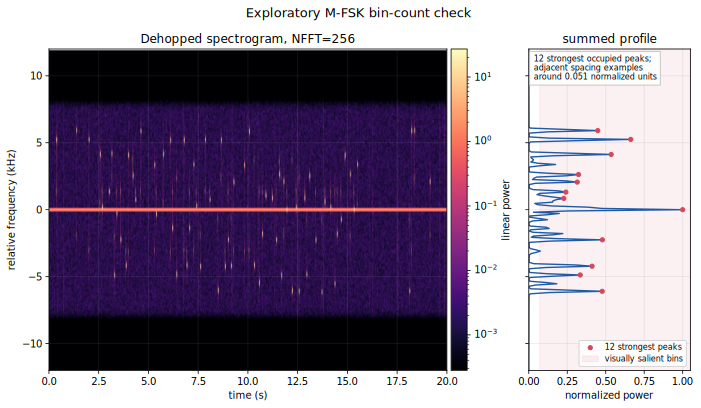
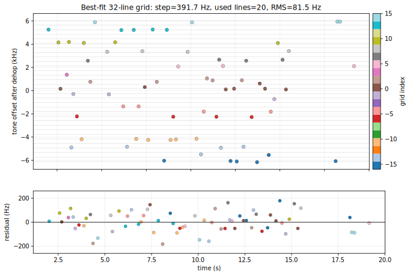
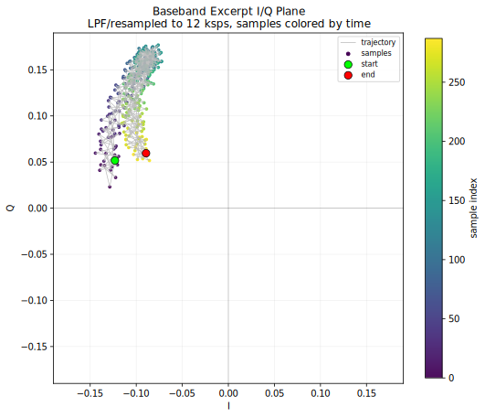
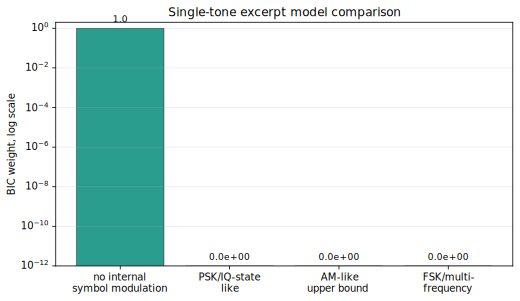

+++
date = 2026-06-01T23:30:00-03:00
draft = false
title = "DEF CON Quals 2026"
description = "DEF CON Quals 2026 — writeups"
tags = ['CTF', 'reversing', 'radio']
categories = []
featured = true
[params]
  locale = "en"
+++

This year we once again played DEF CON Quals as `pwn de queijo`, the joint Brazilian team formed by several [CTF-BR](https://ctf-br.org) affiliated teams. DEF CON CTF Qualifier 2026 was organized by Benevolent Bureau of Birds and ran online from May 22 to May 24, 2026, in the usual Jeopardy format, with challenges spanning pwn, reversing, crypto, web, misc, systems analysis, King of the Hill, and LiveCTF.

Our observed team activity included roughly 73 participants. The group brought together people from Brazilian teams such as ELT, Ganesh, Duckware, SECRET, VESPAS, GRIS, IMEsec, Marcio Herobrine, Boitatech, ACCH, FBLi4, and Hacking Club, as well as participants from institutions including ICMC-USP, IME-USP, UFSCar, UFRJ, UFPR, UFPE, UTFPR, Inatel, and UFMG. The group mixed undergraduates, graduate students, professionals, faculty, and at least one high-school student.

We finished 28th out of 686 teams, with 4583 points and 20 solves, around the top 4.1% of the scoreboard. Our declared AI policy was `HumanLedAi`, matching the event rules that allowed AI-assisted work as long as the effort remained human-led.

This post covers two challenges: an upsolve of `rev/night-owl`, which we did not finish during the CTF, and the final reconstruction of `misc/rfc1149a`, one of the solves that came together through a lot of shared manual and protocol work.

## rev/night-owl

The handout contained a 20 second complex I/Q capture. The file had a custom, undocumented header: at first it was just an `ICLKR` magic followed by a pile of numbers. Only after correlating those fields with the signal did we interpret them as a `500000` samples/s sample rate, `3500 Hz` channel spacing, `1.25 s` dwell time, and `20.0 s` capture duration. The story described a classroom clicker-like system used for quiz answers and attendance.

During the CTF we approached it as a radio reversing problem. We recovered the hopping schedule, dehopped the capture, detected 68 short packet-like bursts, and tried to find packet fields: student IDs, answers, timestamps, or at least a conventional low-rate bitstream. That was the natural expectation for a classroom response system. A useful clicker system needs to know who pressed which answer; otherwise it is only an anonymous poll.

The signal-derived hop schedule had 16 plateaus:

```text
[7000, 80500, -10500, -45500, -73500, -87500, -94500, -98000,
 -70000, 17500, -42000, 84000, 94500, 21000, -24500, -38500]
```

After dehopping, each burst had a stable dominant tone. This is where most of our time went.

### False leads

The first useful visual suggestion came from Paulo Dutra (PU4THZ): plot the dehopped spectrogram and, next to it, the sum of each frequency row. In Python terms, this was essentially:

```python
nfft = 256
ax = subplot(1, 2, 1)
spectrum, _, _, _ = specgram(iq, NFFT=nfft, noverlap=nfft//2, scale="linear")
subplot(1, 2, 2, sharey=ax)
plot(spectrum.sum(axis=1), linspace(-1, 1, spectrum.shape[0]))
ylim([-1, 1])
```

That plot had about a dozen visibly occupied peaks, but the important part was not the count of occupied peaks. We measured the apparent spacing between adjacent peaks, roughly `0.04..0.055` in normalized spectrogram coordinates, and inferred that the underlying alphabet might have around twenty-something possible tones with many unused bins. That made an M-FSK interpretation plausible without yet implying 256-FSK.



Later, an agent optimized a uniform grid against the detected dehopped burst tones. The best fit it found was a 32-line grid with a step of about `391.7 Hz`, using 20 of the 32 implied lines and giving an RMS residual near `81.5 Hz`. This looked tidy enough that we treated it as a likely 5-bit alphabet for a while.



The 32-grid was a plausible dead end. Once the resulting bit/symbol streams stopped making semantic sense, the remaining search space became too guessy for humans to explore productively. At that point, we handed it to agents as a pragmatic way to systematically try combinations. The agents tried filtering speed clickers and late replays, sorting or grouping by response features, interpreting 5-bit symbols as answer alphabets, base32 streams, substitution ciphers, timing bins, inter-arrival deltas, and possible per-device offsets. None of those produced stable text.

We also checked whether this could be a real iClicker-like packet. The open-source [iSkipper](https://github.com/wizard97/iSkipper) implementation was a useful reference point: packet-mode FSK, `85 85 85` sync, a 5-byte answer payload, encoded clicker IDs, answer nibbles, and a checksum. Night Owl did not match it. The iSkipper channel table is MHz-spaced, while this capture used a synthetic-looking +/-100 kHz grid. iSkipper answer packets would be around `0.58 ms`; Night Owl tones were usually `25..35 ms`.

Because the problem statement practically demanded a student ID somewhere, we also looked for data hidden away from the steady tone. We tried early-tone bins, early-to-long transition features, coherent phase, burst durations, response times, time-in-slot, inter-response intervals, RF fingerprint clusters, and waveform families.

To convince ourselves that we were not missing modulation inside each tone, we modeled a centered baseband excerpt in the I/Q plane. The visible trajectory looks structured enough to tempt clustering, but it stays in one quadrant and is better explained as continuous correlated wobble around a single tone than as PSK, QAM, or FSK states.



The model comparison agreed with that interpretation. Under the BIC-weighted models we tested, the single-tone/no-internal-symbol-modulation family won decisively, while PSK/IQ-state, AM-like, and FSK/multi-frequency alternatives received no meaningful weight.



In hindsight, our DSP work was largely correct. What was wrong was the assumption that the challenge signal had to contain the information that the story made operationally necessary.

After the CTF, a public solver from another team made the missing trick clear: treat each burst as one symbol from an extremely fine M-FSK alphabet, close to 256-FSK, map the tone offset directly into an ASCII codepoint, then keep only lowercase letters and underscores.

That is not a satisfying model for the problem statement. It means the useful payload is not a clicker packet at all. It has no student identifier, no answer field, no attendance-relevant identity, and no plausible framing. It is just a sequence of tones where the flag survives after filtering printable-looking characters. The main reason we missed it is that we assumed the fake radio system would preserve at least the minimum semantics required by the story.

### Upsolve

Our final upsolve script is [solve_night_owl.py](./night-owl/solve_night_owl.py). It only needs the original `lecture_capture.iq` handout:

```bash
python3 content/sec/defcon-quals-2026/night-owl/solve_night_owl.py /path/to/lecture_capture.iq
```

The script does the following:

1. Parse the custom header fields we had learned to interpret.
2. Load the complex64 I/Q payload after the 4096-byte header.
3. Detect the 68 short tones by thresholding 5 ms energy frames.
4. Recover the 16 FHSS plateaus by majority-voting dominant frequencies in 50 ms subwindows.
5. For each detected tone, mix by the corresponding plateau frequency, effectively dehopping that burst.
6. Estimate the stable middle tone with a zero-padded FFT and parabolic peak interpolation.
7. Decode the tone as a direct ASCII code:

```python
codepoint = round(ord("_") + (freq_hz - underscore_hz) / step_hz)
```

with `underscore_hz = -2250.0` and `step_hz = 150.8`.

8. Keep only `a-z` and `_`.

The relevant part of the output is:

```text
decoded header: {'magic': 'ICLKR', 'sample_rate': 500000, 'dwell_s': 1.25, 'duration_s': 20.0}
recovered carrier offsets: [7000, 80500, -10500, -45500, -73500, -87500, -94500, -98000, -70000, 17500, -42000, 84000, 94500, 21000, -24500, -38500]
detected bursts: 68

idx   time_s   freq_hz code  char
  4    2.690    155.52  111   o <= msg
  5    3.045   1367.25  119   w <= msg
  8    3.413   -290.27  108   l <= msg
  9    3.612  -2219.80   95   _ <= msg
 13    4.365    760.63  115   s <= msg
 ...
 55   13.867    604.80  114   r <= msg
 56   14.165    163.82  111   o <= msg
 58   14.485  -1812.92   98   b <= msg
 59   14.688   -727.58  105   i <= msg
 62   15.338     80.57  110   n <= msg

recovered_message = owl_sleeps_but_not_robin
FLAG = bbb{owl_sleeps_but_not_robin}
```

The upsolve flag is:

```text
bbb{owl_sleeps_but_not_robin}
```

### Takeaway

The DSP work we did during the CTF was not wasted: the recovered hop schedule, carrier plateaus, and burst detection were all correct enough to solve the challenge. The failure was in the protocol assumption. We expected a clicker-like system to contain clicker-like information, especially a student identity. The actual solution only required a very wide tone alphabet and a flag-character filter.

That makes `night-owl` a poor reversing challenge in our view. A challenge can absolutely be synthetic, but when the prompt asks us to reverse a classroom response system, the signal should not contradict the core reason such a system exists.

## misc/rfc1149a

`rfc1149a` was a much better kind of pain.

The handout was a set of photos of small paper strips. The challenge title was not subtle: RFC 1149 is the classic April Fools' "IP over Avian Carriers" RFC, and the papers were hexdumps of IPv4/TCP packets carried by pigeons. The first useful observation was that the dumps were not Ethernet frames. They started directly at the IPv4 header:

```text
45 00 ... 40 06 ...
```

From there, the job split into two tracks. One track was pure manual labor. A lot of people, especially from Ganesh, kept transcribing hex from the photographed strips by hand. As the night went on, more people joined to check and retype bytes, including Cloudlabs students such as luizot and kyo. The other track was analysis: reconstruct packets, sort TCP segments by sequence number, remove IP/TCP headers, join payloads, and see what HTTP objects came out.

The reconstructed traffic pointed at:

```text
supersecretflagserverdonttellanyoneaboutit.rfc1149.ctfwithbirds.com
```

One detail made live testing slightly annoying: DNS for that hostname did not point to the same server IP carried inside the pigeon's IPv4 headers. The packets used `34.16.111.14`, so we had to pin the name locally, for example with:

```text
34.16.111.14 supersecretflagserverdonttellanyoneaboutit.rfc1149.ctfwithbirds.com
```

That created an obvious temptation. In parallel with the packet reconstruction, we poked at the web service: `/`, `/login`, `/register`, `/flag`, static CSS, cache metadata, headers, session behavior, and the usual "maybe there is a web bug after all" ideas. None of that went anywhere, and we did not have much faith in it anyway. The category and handout were telling us this was a packet reconstruction challenge, not a web exploitation challenge.

### Reassembly

The visible packets formed normal HTTP/TCP responses. Some examples were static CSS, theme files, and authenticated-looking pages. One important flow started with a `302 FOUND` response:

```text
HTTP/1.1 302 FOUND
Server: nginx/1.22.1
Date: ...
Content-Type: text/html; charset=utf-8
Content-Length: 189
Connection: keep-alive
Location: /
Set-Cookie: session_id=<8 hex chars>; Max-Age=2592000; Path=/
```

The problem was that the useful middle of that response was missing from the available paper fragments. The first `b0` strip gave the beginning of the response:

```text
HTTP/1.1 302 FOUND
```

and the next visible piece resumed inside the redirect body:

```text
uld be redirected automatically to the target URL: <a href="/">/</a>
```

After aligning this with a live login response from the server, the missing range clearly contained the `Set-Cookie` header. The admin `session_id` was exactly where we needed it to be, and exactly where the paper was not.

For a while that looked terminal. We kept transcribing because every extra byte could matter. People searched for partial cookie bytes, neighboring packets, request-size deltas, cache artifacts, path leaks, and gzip recovery. The work improved our understanding of the traffic, but it still did not reveal the cookie.

### The checksum trick

The breakthrough came from Henrique Marcomini (Suppito), UFSCar alumni. He noticed that even if the cookie bytes were missing visually, they still participated in the TCP checksum of the `b0` packet.

That matters because the unknown was small: `session_id` was eight lowercase hex characters. TCP uses a 16-bit one's-complement checksum over the pseudo-header, TCP header, and payload. If all other bytes of the segment are known or modeled, the checksum gives a strong constraint on those eight missing ASCII bytes.

There was also a small but important correction in `b0`: the transcribed IPv4 total length looked like `0x0100`, but the IPv4 header checksum validates for `0x0180`. With a 20-byte IPv4 header and a 32-byte TCP header, that means `b0` carried `332` bytes of TCP payload, enough to include the complete cookie value at payload offset `200`.

The core equation was:

```text
checksum(pseudo_header || tcp_header_with_zero_checksum || http_payload(session_id)) == 0x61bf
```

Instead of brute-forcing `16^8` cookies directly, we split the 8-character cookie into two 4-character halves and precomputed the raw 16-bit word sums for each half. Then we only joined halves whose one's-complement sum could satisfy the observed checksum.

This was enough to turn the search space from impossible into something we could test against `/flag`.

### The Date problem

My first attempt and Suppito's first attempt both failed for the same reason: we used the wrong HTTP `Date` header for the missing `302`. That byte range was also absent from the pigeon papers, and the checksum is sensitive to every byte in the TCP payload.

One nearby packet had a visible HTTP date:

```text
Date: Tue, 05 May 2026 23:16:01 GMT
```

Using that directly was wrong. Suppito also computed:

```text
Tue, 05 May 2026 22:55:18 GMT
```

from a neighboring TCP timestamp relation. That also did not solve it.

The final correction came from itzin, from Ganesh. He asked an agent to reason over the TCP timestamps and infer the right Date for `b0`; that gave:

```text
Tue, 05 May 2026 22:20:21 GMT
```

With that Date, the checksum-constrained candidate set became small enough to test. During the CTF, that produced the valid admin session and the flag.

I could not reproduce the final online hit while writing this post on June 2, 2026. Running the recovered candidate set at a maximum of 50 requests per second against the still-online service produced:

```text
candidates=34800
401: 34599
429: 148
connection failures: 37
unparseable/empty status: 15
502: 1
```

So the current service no longer validates any candidate from this reconstruction. That is not too surprising for a session-cookie solve after the event: the server state may have changed, the admin session may have expired or been rotated, or some byte-level detail from the live solve may still differ from this reconstruction. The important part for the write-up is the method.

### Solver

The final reconstruction script is [solve_rfc1149a.py](./rfc1149a/solve_rfc1149a.py). It is deliberately self-contained. The constants in the script are just the minimal facts recovered from the handout and Discord log:

```bash
python3 content/sec/defcon-quals-2026/rfc1149a/solve_rfc1149a.py
```

Offline, it prints the checksum-derived candidates:

```text
date='Tue, 05 May 2026 22:20:21 GMT'
b0_total_len=0x0180 b0_payload_len=332
tcp_checksum=0x61bf tcp_window=0x01fa
session_id_payload_offset=200
candidates=34800
first_candidates=60949f9f,60959e9f,60959f9e,60969d9f,60969e9e,...
```

For an online retry against the challenge service, it has an explicit rate limit:

```bash
python3 content/sec/defcon-quals-2026/rfc1149a/solve_rfc1149a.py --online --rate 50
```

The essential part is the checksum reduction, not the HTTP testing:

```python
target = (~tcp_checksum) & 0xffff
base = raw_word_sum(packet_with_zeroed_session_id)

for raw_a, strings_a in precomputed_4hex_half_sums.items():
    raw_b = target + k * 0xffff - base - raw_a
    for a in strings_a:
        for b in precomputed_4hex_half_sums.get(raw_b, ()):
            candidate = a + b
```

That is the piece that made the missing paper bytes recoverable at all.

### Takeaway

This challenge rewarded the right kind of collaboration. Manual transcription alone was not enough, and protocol analysis alone was not enough. The solve needed both: enough packet bytes to model the missing response, and the observation that a checksum over missing data is still information about that data.

The exact `Date` dependency made the solve require more care. We had the right checksum idea, but it only became useful once the correct timestamp-derived Date was found. In hindsight, this was a good reminder that in packet forensics, "almost the same HTTP response" is not the same byte string. A single wrong second in a header is enough to send the checksum search into the wrong candidate set.

## Acknowledgements

We thank [Trend Micro](https://www.trendmicro.com/) and [Elytron Security](https://elytroncybersecurity.com/) for sponsoring the event and providing the venue, [Flip Side](https://www.flipside.com.br/) for logistical support, [Xiaomi](https://www.mi.com/) for [MiMo](https://mimo.mi.com/) model tokens, [CeMEAI](https://cemeai.icmc.usp.br/) for access to experimental compute nodes, and [MagaluCloud](https://magalu.cloud/) for cloud infrastructure and for sponsoring Cloudlabs.
