+++
date = 2026-03-31T10:00:00-03:00
draft = false
title = "Matryoshka v2 Writeup"
description = "Matryoshka v2 Writeup — how nested can your binary be?"
tags = ['CTF', 'reversing', 'windows', 'malware-analysis']
categories = []
featured = true
[params]
  locale = "en"
+++

Just like the nested Russian dolls after which this challenge is named, the deeper you dig, the more layers you’ll uncover. This article is a writeup of [Matryoshka v2](https://crackmes.one/crackme/69a291ba0f5b9757a6a5f6ff), a challenge from [crackmes.one](https://crackmes.one) Reverse Engineering CTF of 2026.

## Start

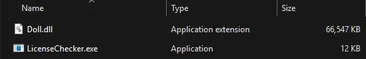

We are given two files, **Doll.dll, LicenseChecker.exe**. The first thing to notice is that as LicenseChecker.exe is a small file (12KB) Doll.dll in the other hand is huge (around ~65mb) so we already know something spooky is happening in this dll.

## First executions

Upon executing LicenseChecker.exe we are faced with an error message about reading _license.bin_

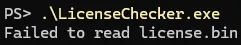

After creating a generic _license.bin_, the output persists; only after we write gibberish to _license.bin_ the output changes to _“Wrong license”:_

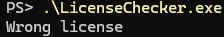

There is not much information here, we need to go to static analysis about the two files.

## die.exe -> LicenseChecker.exe

Using [die.exe](https://github.com/horsicq/Detect-It-Easy), we don’t find anything weird, but we see that it imports [LoadLibraryA](https://learn.microsoft.com/en-us/windows/win32/api/libloaderapi/nf-libloaderapi-loadlibrarya) and [GetProcAddress](https://learn.microsoft.com/en-us/windows/win32/api/libloaderapi/nf-libloaderapi-getprocaddress), which is expected since there is a dll to be imported.

## die.exe -> Doll.dll

The giant dll only exports a single function called _CheckPassword_, which doesn’t explain the file size. But when we go to resources tab:

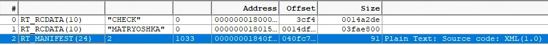

We see “CHECK”, “MATRYOSHKA”, and a simple manifest that we can ignore.

MATRYOSHKA’s size is **0x3FAE800** = 66,775,040 ~= 65mb, so THIS is making the dll huge in size.

Both **CHECK** and **MATRYOSHKA** seem not readable, but as we’ll see later, **CHECK** contains runnable code.

## Analysing main()

Ida could easily find main entrypoint and reading the function we see that:

1.  Reads _license.bin_ to a var (licenseStr)

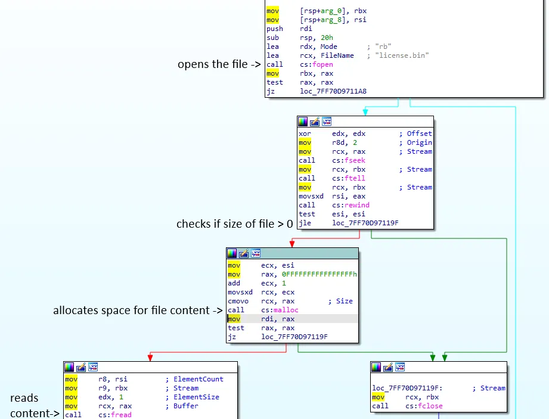

1.  Loads “Doll.dll”
2.  Gets “CheckPassword” address
3.  Calls _CheckPassword_, passing licenseStr as an argument
4.  Compares the result to 1 (success / true)
5.  If 1 => “Correct license”
6.  If != 1 -> “Wrong license”

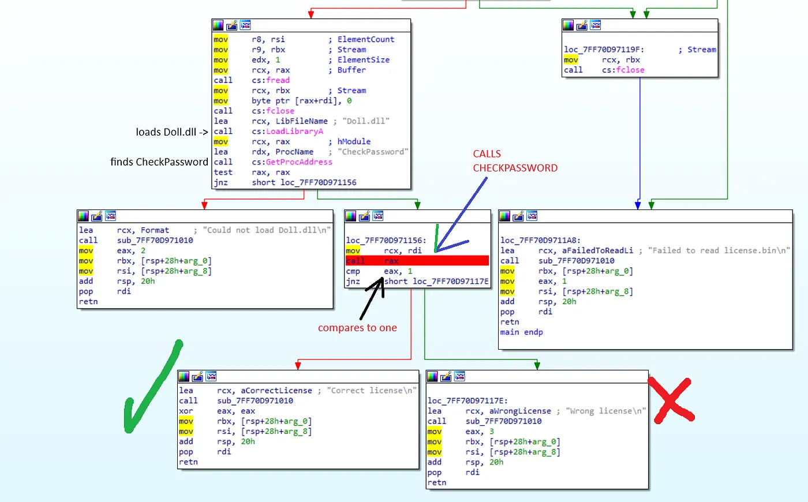

Simple process, read the license, call the important function_…_ exit.

Now our focus should be in this CheckPassword function

## CheckPassword

The function is bigger than shown in the next picture but for now this is our next subchallenge, let me explain:

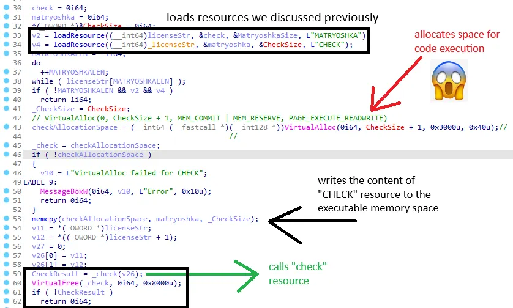

> The vars **&check** and **&matryoshka**, seem swapped in lines (33, 34 and **53**), but that is because they are used in another way after line 62

Let’s break down what the start of CheckPassword is doing:

1.  Loads “MATRYOSHKA” and “CHECK” resources (lines 33 and 34)
2.  Allocates space for “CHECK”, but setting flags for **code execution** (line 43)
3.  Copies CHECK content to this new memory space (line 53)
4.  Calls check function (line 59, I forgot to rename the var but v26 points to our **licenseStr’s** first 32bytes)
5.  Checks if the result is a success, if not, returns 0

The Full CheckPassword function has more lines; but for now, if we can’t figure out how to make _check_ return something **positive** we can’t proceed.

## Check — Where the real challenge begins

For now, we’ve been looking at code that mostly makes sense right? Functions to read the license… check the license, loading random code into memory (ok this doesn’t make that much sense). But let’s take a look at the code for **_check():**

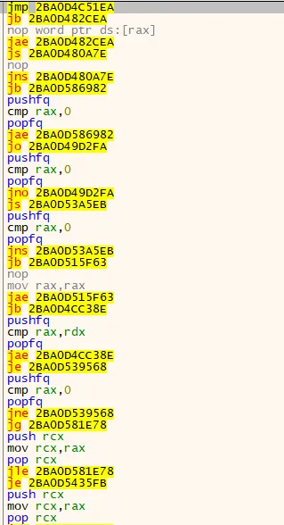

This is the code found in CHECK resource and it looks _interesting_. We are dealing with some sort of **protector** specifically meant to make our lives harder

If you look closely at the _2nd_ and _4th_ lines, you can see that they both point to the same address **0x2BA0D482CEA**, also the mnemonics are _opposite_ branches: (**jb** and **jae**)

That means that if the computer lands at this second instruction, it will always go to address **0x2BA0D482CEA**

And there is more! The instruction between these jumps is a **_nop_** so the computer state stays the same.

In the other cases where we see other instructions in between the jumps, they also preserve computer state.

This structure follows the full code of CHECK, and I did try to _painstakingly_ step over them until I hit a useful instruction, and that worked… _for like three useful instructions_, until I already lost what made sense and what didn’t XD So that was a no go ;}

I’m going to skip my failed attempts to also find a anti-protector of this type, maybe they exist maybe they don’t. Regardless I realized it was time for **patching** this Doll.dll for **GOOD**

## Python is our friend

I tried prompting an LLM to make code for IDA, but having more experience with python that worked best.

This open source library called [**iced**](https://github.com/icedland/iced) provides functions to disassemble and assemble code and parse the required information in abstractions that we can easily access, so that was perfect for our patching.

The strategy was, to build a patching algorithm that could remove these weird jumps and change them to useful simple **jmp** instructions. To do that, the script:

1.  Keeps a list of the next 5 instructions
2.  If the first instruction is a conditional jump:
3.  Search for the opposite conditional jump in the next 4 instructions
4.  If it finds the opposite jump AND they point to the same address:
5.  Change the first instruction to a non conditional jump
6.  Fill the rest (until after the opposite jmp) with nops

The code that executes the steps above is called _fix_check_:

```python
from iced_x86 import Decoder, DecoderOptions, Mnemonic, Instruction, BlockEncoder, Code
def fix_check(CHECK_FP, FIXED_CHECK_FP):
    CODE = b""
    with open(CHECK_FP, "rb") as file:
        CODE = file.read()
    FIXED_CODE = bytearray(CODE[:])
    print(len(FIXED_CODE))
    IP = 0
    decoder = Decoder(64, CODE, ip=IP)
    decoder_iter = iter(decoder)
    instructions = []
    instructions.append(next(decoder_iter))
    instructions.append(next(decoder_iter))
    instructions.append(next(decoder_iter))
    instructions.append(next(decoder_iter))
    instructions.append(next(decoder_iter))
    allJumps = set()
    allJumps.add(Mnemonic.JG)
    allJumps.add(Mnemonic.JLE)
    allJumps.add(Mnemonic.JL)
    allJumps.add(Mnemonic.JGE)
    allJumps.add(Mnemonic.JB)
    allJumps.add(Mnemonic.JAE)
    allJumps.add(Mnemonic.JS)
    allJumps.add(Mnemonic.JNS)
    allJumps.add(Mnemonic.JO)
    allJumps.add(Mnemonic.JNO)
    allJumps.add(Mnemonic.JA)
    allJumps.add(Mnemonic.JBE)
    allJumps.add(Mnemonic.JP)
    allJumps.add(Mnemonic.JNP)
    allJumps.add(Mnemonic.JE)
    allJumps.add(Mnemonic.JNE)
    jumpOpposite = {
        Mnemonic.JG: Mnemonic.JLE,
        Mnemonic.JGE: Mnemonic.JL,
        Mnemonic.JL: Mnemonic.JGE,
        Mnemonic.JLE: Mnemonic.JG,
        Mnemonic.JB: Mnemonic.JAE,
        Mnemonic.JS: Mnemonic.JNS,
        Mnemonic.JNS: Mnemonic.JS,
        Mnemonic.JO: Mnemonic.JNO,
        Mnemonic.JNO: Mnemonic.JO,
        Mnemonic.JA: Mnemonic.JBE,
        Mnemonic.JBE: Mnemonic.JA,
        Mnemonic.JB: Mnemonic.JAE,
        Mnemonic.JAE: Mnemonic.JB,
        Mnemonic.JP: Mnemonic.JNP,
        Mnemonic.JNP: Mnemonic.JP,
        Mnemonic.JE: Mnemonic.JNE,
        Mnemonic.JNE: Mnemonic.JE,
    }
    # patches dead code ofuscation
    while instructions:
        instr = instructions[0]
        if instr.mnemonic in allJumps:
            
            oppositeJmpMnemonic = jumpOpposite[instr.mnemonic]
            oppositeJmp = next(filter(lambda ins: ins.mnemonic == oppositeJmpMnemonic, instructions[1:]), None)
            
            
            if oppositeJmp:
                
                if oppositeJmp.near_branch_target == instr.near_branch_target:
                    
                    new_instr = Instruction.create_branch(Code.JMP_REL32_64, instr.near_branch_target)
                    
                    encoder = BlockEncoder(64)
                    encoder.add_many([new_instr])
                    
                    new_instr_bytes = encoder.encode(instr.ip)
                    FIXED_CODE[instr.ip:instr.ip + len(new_instr_bytes)] = new_instr_bytes
                    
                    how_many_nops = oppositeJmp.next_ip - (instr.ip + len(new_instr_bytes))
                    FIXED_CODE[instr.ip + len(new_instr_bytes): oppositeJmp.next_ip] = b"\x90" * how_many_nops
            
            #print()
        else:
            pass
        instructions = instructions[1:]
        try:
            instructions.append(next(decoder_iter))
        except:
            pass
    with open(FIXED_CHECK_FP, "wb") as file:
        file.write(FIXED_CODE)
if __name__ == "__main__":
    
    CHECK_FP = "../RT_RCDATA(10)__CHECK__0.bin" # resource exported using die.exe
    FIXED_CHECK_FP = "../FIXED_CHECK.bin"
    fix_check(CHECK_FP, FIXED_CHECK_FP)
```

There’s nothing much to say about this code. I don’t know how useful it is to explain the scripts line by line, understanding _how_ it works should be enough.

## Jump hell and jumpcut

Even after fixing this jumps with conditional mess, check code still makes a lot of jumps one after the other. This is what I mean:

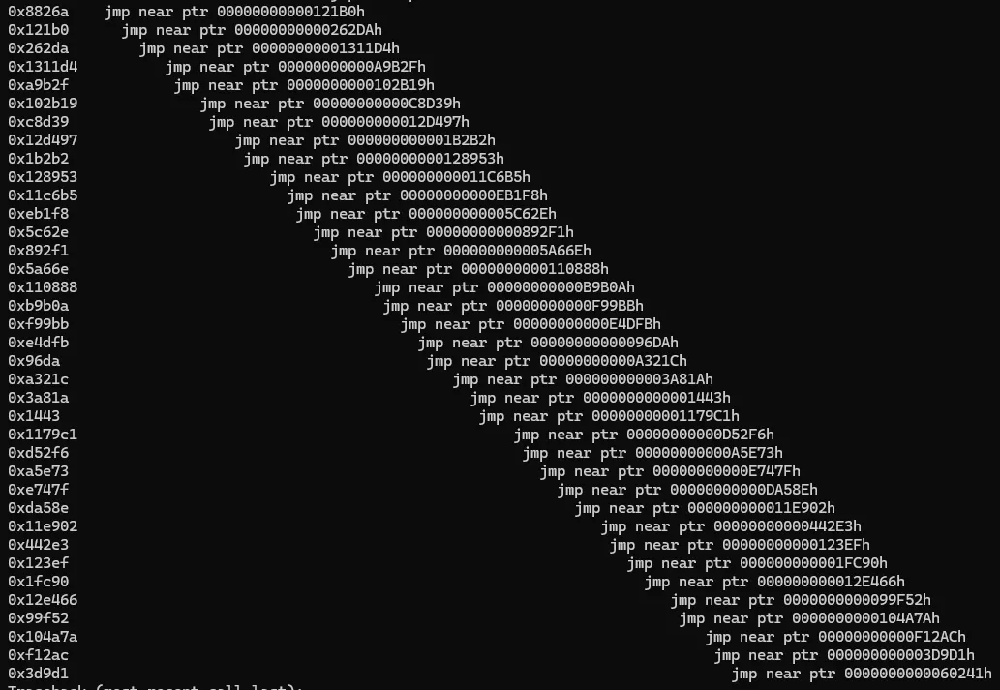

Although not the worst thing in the world, still pretty bad for analisys.

This following code is not optimized and still contains giberrish, but it does the following:

1.  Sequentially pull all jmps from the file
2.  Reads and saves the _hell jmp sequence_
3.  For every jump in the tree:
4.  Patch it to the furthest jmp in the tree*

Step 4 is not so simple, because a jmp to a location too far can make the instruction need _more bytes than it used to have_, which may not be possible (could override other instruction); it depends on the number of nops that are “available” after the jmp instruction:

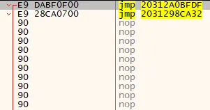

The mitigation is to patch it to instructions that are closer but minimize the hell sequence, so it just goes back the hell sequence trying to jmp to these addresses, sometimes it is not possible, but it’s fine because having one or two more jumps will not be that bad for the analysis

```python
from iced_x86 import Decoder, DecoderOptions, Mnemonic, Instruction, BlockEncoder, Code
def jumpcut(FIXED_CHECK_FP, FIXED_JUMPCUT_FP):
    CODE = b""
    with open(FIXED_CHECK_FP, "rb") as file:
        CODE = file.read()
    FIXED_CODE = bytearray(CODE[:])
    print(len(FIXED_CODE))
    IP = 0
    decoder = Decoder(64, CODE, ip=IP)
    processed_instr = set()
    def fixJumpLoop(instr):
        stack = []
        stack.append(instr)
        
        offset = instr.near_branch_target
        next_instr = Decoder(64, CODE[offset:], ip=offset).decode()
        while next_instr.mnemonic == Mnemonic.JMP:
            print(hex(next_instr.ip), len(stack) * "  ", next_instr)
            stack.append(next_instr)
            offset = next_instr.near_branch_target
            next_instr = Decoder(64, CODE[offset:], ip=offset).decode()
        # here instr is not a jump
        # offset is the offset to the first nonjmp instr
        
        for instr in stack:
            for target in [next_instr, *stack[1::-1]]:
                encoder = BlockEncoder(64)
                
                patched_instr = Instruction.create_branch(Code.JMP_REL32_64, target.ip)
                encoder.add_many([patched_instr])
                patched_instr_bytes = encoder.encode(instr.ip)
                # instr is 4
                # patch is 5
                # 2 nops
                
                _start_nop = CODE[instr.ip + instr.len:]
                current_nops = 0
                while current_nops < len(_start_nop) and _start_nop[current_nops] == 0x90:
                    current_nops += 1
                
                if len(patched_instr_bytes) > (instr.len + current_nops):
                    # happens to not be reached
                    print("CRY", len(patched_instr_bytes) - instr.len)
                else:
                    FIXED_CODE[instr.ip:instr.ip + len(patched_instr_bytes)] = patched_instr_bytes
                    n_nops = instr.len - len(patched_instr_bytes)
                    if n_nops > 0:
                        FIXED_CODE[instr.ip + len(patched_instr_bytes): instr.ip + instr.len] = b"\x90" * n_nops
                    processed_instr.add(instr.ip)
                    break
    i = 0
    for instr in decoder:
        if instr.mnemonic == Mnemonic.JMP and instr.ip not in processed_instr:
            fixJumpLoop(instr)
            i += 1
            
            if i % 100 == 0:
                print(100 * instr.ip / len(FIXED_CODE)) # percentage
    with open(FIXED_JUMPCUT_FP, "wb") as file:
        file.write(FIXED_CODE)
if __name__ == "__main__":
    FIXED_CHECK_FP = "./FIXED_CHECK.bin"
    FIXED_JUMPCUT_FP = "../FIXED_JUMPCUT_CHECK.bin"
    jumpcut(FIXED_CHECK_FP, FIXED_JUMPCUT_FP)
```

Forgot to mention, to do all of this patching I exported CHECK resource using _die.exe_ and used this python script to put it back into the dll:

```python
doll = open("Doll.dll", "r+b")
check = open("CHECK.bin", "rb")
patched_check = open("FIXED_JUMPCUT_CHECK.bin", "rb")
offset = doll.read().find(check.read())
doll.seek(offset)
doll.write(patched_check.read())
# 68,144,128
doll.close()
check.close()
patched_check.close()
```

After all this code mess (which took like 3 days cause idk libs and I changed the algorithm more than once), this is what we get when we open x64dbg at _CHECK_

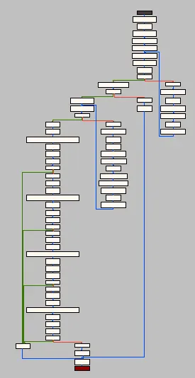

There are still a lot of jumps, that’s why we see a lot of small rectangles, but still, now we **CAN** look at the graph view (it wasn’t possible before because x64dbg would not support the number of nodes to display)

## CHECK function

Ida has a problem working with these blocks with jumps, so the analysis will follow through x64dbg

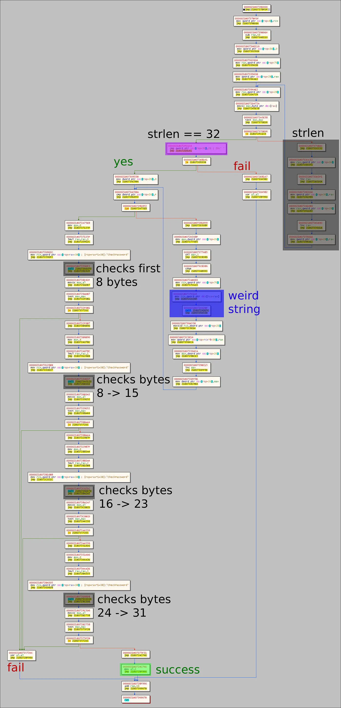

So what is happening?

1.  Checks if the licenseStr is 32 bytes (the full license is bigger but I’ll explain this later):
2.  For every 8 bytes of the 32 bytes, the program call’s a function that I named “weird string”, that outputs other 8 bytes
3.  For every 8 bytes of these new set of 32 bytes, the program calls a different checking function that validates whether they are the expected ones or not

Our goal now is to **understand** how the **checking** works, and also how the “weird string” is transforming our input

## Validation

I decided to understand first the validation part (validating the new 32bytes)

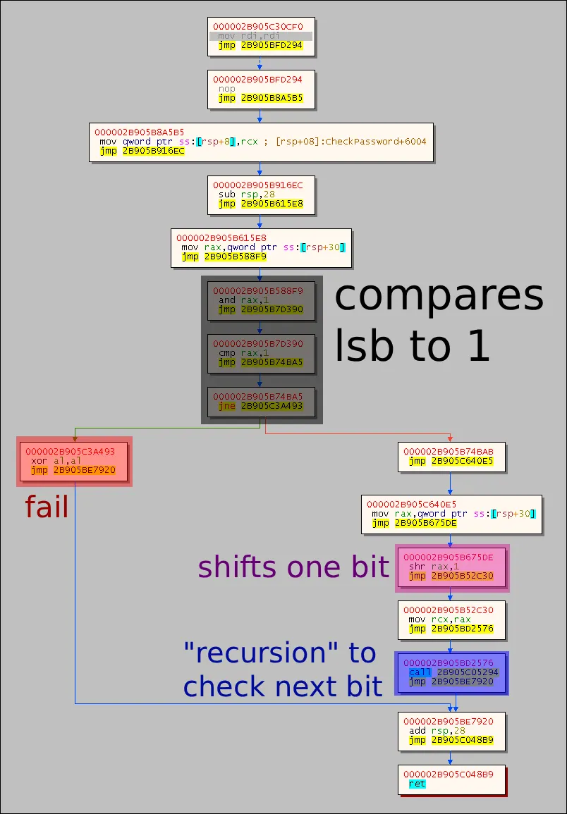

The function:

1.  Compares the last bit to 1 (or zero, using test rax, rax)
2.  If it fails, clears **al** and returns
3.  If it validates, shifts the 8bytes by 1 bit and calls another function just like this one (a semi-recursion, since the function called will be different, because it might check for the opposite bit and will always call the _next_ function of this “bitpath”)

This “recursion” calls another function that is similar to this one, but that could compare the bit to 0 instead of one. Inside the dark rectangle we can see:

```assembly
and rax, 1
cmp rax, 1
jne fail
```

But when it wants to check for the bit 0 the instruction changes to

```assembly
and rax, 1
test rax, rax
jne fail
```

> Apart from this change, there is another sublety when comparing the last bit of all. It doesnt need the **_and rax, 1_** (which clears all other bits to just compare the least significant one), but also, instead of testing it uses **cmp rax, 0**. Just for the sake of showing here is the last function of this “recursive” chain:

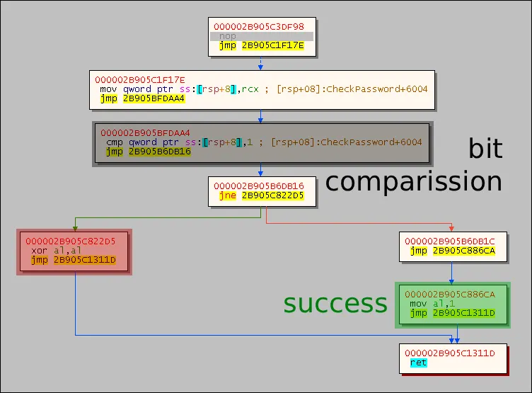

The goal at this point was to write a script capable of counting the **_cmp_** and **_test_** to reverse engineer the bits required by the checking functions.

Remember, these bits are also the output of _weird_string_.

For this to work, we need to find the offsets of these functions that check bits, which is done by the following script:

```python
from iced_x86 import *
def follow_jumps_until(CODE, offset, mnemonics, IP):
    if type(mnemonics) != list:
        mnemonics = [mnemonics]
    decoder = Decoder(64, CODE[offset:], ip=IP + offset)
    
    instr = decoder.decode()
    while instr.mnemonic != Mnemonic.JMP and instr.mnemonic not in mnemonics:
        instr = decoder.decode()
    
    
    if instr.mnemonic == Mnemonic.JMP:
        offset = instr.near_branch_target - IP
        return follow_jumps_until(CODE, offset, mnemonics, IP)
    
    return instr
def follow_jumps_after_jump(CODE, jmp, mnemonics, IP):
    offset = jmp.near_branch_target - IP
    return follow_jumps_until(CODE, offset, mnemonics, IP)
def walk_one_and_jmp(CODE, target, IP):
    decoder = Decoder(64, CODE[target - IP:], ip=target)
    
    while(instr:=decoder.decode()).mnemonic != Mnemonic.JMP:
        continue
    
    return instr
def find_offsets(FIXED_JUMPCUT_FP):
    
    with open(FIXED_JUMPCUT_FP, "rb") as file:
        CODE = file.read()
    IP = 0x0
    je = follow_jumps_until(CODE, 0, Mnemonic.JE, IP)
    je2 = follow_jumps_after_jump(CODE, je, Mnemonic.JE, IP)
    jge = follow_jumps_after_jump(CODE, je2, Mnemonic.JGE, IP)
    call1 = follow_jumps_after_jump(CODE, jge, Mnemonic.CALL, IP)
    call2 = follow_jumps_until(CODE, call1.next_ip - IP, Mnemonic.CALL, IP)
    call3 = follow_jumps_until(CODE, call2.next_ip - IP, Mnemonic.CALL, IP)
    call4 = follow_jumps_until(CODE, call3.next_ip - IP, Mnemonic.CALL, IP)
    offset1 = walk_one_and_jmp(CODE, call1.near_branch_target, IP).near_branch_target - IP
    offset2 = walk_one_and_jmp(CODE, call2.near_branch_target, IP).near_branch_target - IP
    offset3 = walk_one_and_jmp(CODE, call3.near_branch_target, IP).near_branch_target - IP
    offset4 = walk_one_and_jmp(CODE, call4.near_branch_target, IP).near_branch_target - IP
    print(hex(offset1))
    print(hex(offset2))
    print(hex(offset3))
    print(hex(offset4))
    
    return [offset1, offset2, offset3, offset4]
if __name__ == "__main__":
    FIXED_JUMPCUT_FP = "./FIXED_JUMPCUT_CHECK.bin"
    find_offsets(FIXED_JUMPCUT_FP)
```

Nothing much to explain here, just that **follow_jumps_until** is a useful function that follows all the instructions, considering branching, until it hits a Mnemonic specified by you and that the algorithm starts at check, looks for the conditional branches until we hit the validation functions and returns the offsets of these functions.

> You might be asking why that is useful, since we can just look at x64dbg offset and yes, that is what I did, but there is more to this challenge that I don’t want to spoil yet

The offsets:

> 0x12a46f
> 0x91079
> 0x11034d
> 0x4e86f

Now the algorithm that gets the bits and returns them:

```python
from iced_x86 import Decoder, Mnemonic
from find_offsets import follow_jumps_until
RIP = 0
def get_bits(CODE, offset):
    IP = 0
    
    for i in range(64):
        instr = follow_jumps_until(CODE, offset, [Mnemonic.TEST, Mnemonic.CMP], IP)
        
        
        if instr.mnemonic == Mnemonic.CMP:
            yield instr.immediate(1)
        elif instr.mnemonic == Mnemonic.TEST:
            yield 0
        else:
            yield 'X'
        
        
        if i == 63:
            return
            
        instr = follow_jumps_until(CODE, offset, Mnemonic.CALL, IP)
        offset = instr.near_branch_target - IP
def find_weird_string(FIXED_JUMPCUT_CHECK_FP, offsets):
    with open(FIXED_JUMPCUT_CHECK_FP, "rb") as file:
        CODE = file.read()
    finals = []
    
    for start in offsets:
        bits = get_bits(CODE, start)
        lbits = []
        for i, bit in enumerate(bits):
            #print(i, bit)
            lbits.append(bit)
            
        final = "".join(map(str,map(int, lbits)))[::-1]
        final = int(final, 2)
        finals.append(final)
    print("\n".join(map(hex, finals)))
    
    return finals
if __name__ == "__main__":
    
    FIXED_JUMPCUT_CHECK_FP = "./FIXED_JUMPCUT_CHECK.bin"
    offsets = [0x568d7, 0xc64ec, 0x9ef02, 0x9bd93]
    
    find_weird_string(FIXED_JUMPCUT_CHECK_FP, offsets)
```

> 0xfabbd91f04381f89
> 0xd13f557d1b36e7cc
> 0x501aeba922f2c44c
> 0x857a1bea6419ce73

Upon forcing these values in x64dbg we can assure they are indeed correct! Great!

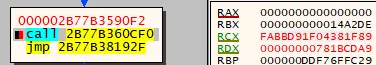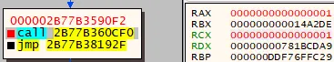

## Weird String

I switched to BinaryNinja because when writing this article IDA couldn’t decompile the function anymore. Idk what happened to IDA:

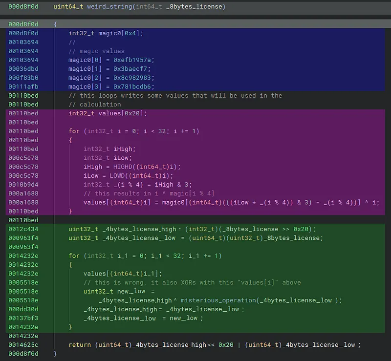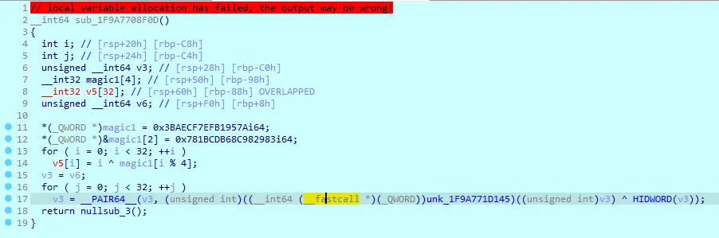

## Blue and Magenta section

The blue section sets the “magic numbers” that will be used in the magenta section.

The magenta section populates an array called values by executing:

> _values[i] = i ^ magic[i % 4]; // just like ida is showing in lines 13 and 14_

Before I explain how weird_string green section works, let’s first understand the **misterious_operation**, found in the green section

## Misterious operation

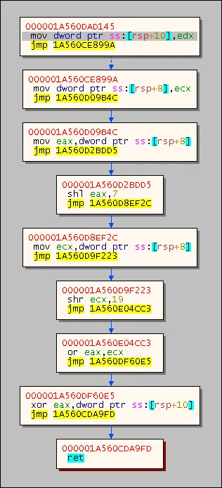
```c
// binary ninja didn't get valuesi as argument but it is there
int misterious_operation(int32_t first4BytesLicense, int32_t valuesi)
{
  return ((first4BytesLicense << 7) | (first4BytesLicense >> 25)) ^ valuesi;
}
```

That’s it… It changes the order of some bits and XORs with the value from the array of values. Also yeah it takes more arguments and Binary Ninja couldn’t decompile that correctly.

It’s important to notice tho, that no information is lost in the process of shifting left 7 bits and ORing with shifted right 25 bits, since 25 + 7 = 32, so that is a **reversible** process.

## Weird String — The end

Binary Ninja gives a pretty good grasp at what is happening, first there is a procedure:

1.  starts from two “magic” 64bit numbers (blue section)
2.  populates, based on the magic numbers, an array called values (pink/magenta)
3.  for every **value** in the array, updates 8bytes_license (4bytes_license_high and 4bytes_license_low) by:
    a. new high = previous low
    b. new low = (**previous high** ^ ((**low** << 7) | (**low** >> 25)) ^ **valuesi**)

Our goal now is to revert the process above, so that starting with the values found earlier, such as **0xfabbd91f04381f89**, we find the respective 8bytes_license that generates it.

From 3.a, we know that:

> _new high = previous low, so_
> 
> **_0xfabbd91f04381f89 -> previous =_ 0xXXXXXXXXfabbd91f**

From 3.b we know that:

> prev_high = new_low ^ ((low << 7) | (low >> 25)) ^ valuesi)

But XOR is a **reversible** operation (if you xor a number two times by the same value it goes back to the first number) and also **commutative**, so a ^ b = b ^a, which means we can isolate the previous_high

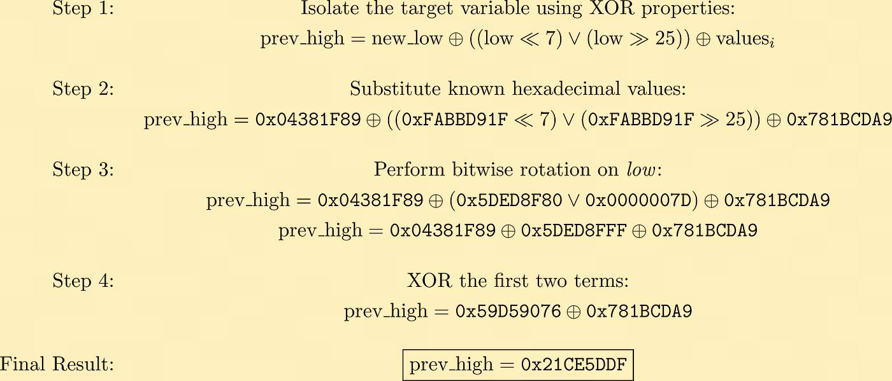

> _previous_8bytes_license =_ **_0x21cf5dddfabbd91f_**

If we do this 32 times in a row, we can find out that the initial value (first 8bytes of licenseStr) must be tcharaaaaam:

> **‘M0Oo8zjH’ (in ASCII representation)**

Now we just need to repeat this for the other values found by _find_weird_string_

```python
def misterious(rcx, edx):
 return (((((rcx << 7) & 0xffffffff) | ((rcx & 0xffffffff) >> 0x19)) ^ edx) ^ (rcx >> 32))
def for8bytes(start, values):
 #start = 0x4847464544434241
 tmp = start
 for v in values:
  tmp = ((tmp & 0xffffffff) << 32) | misterious(tmp, v)
 return tmp
def reverse(values):
    def wrapper(last):
        current = last
        for v in reversed(values):
                
            low = current & 0xffffffff
            high = current >> 0x20
            
            shenanigan = (((high << 7) & 0xffffffff) | ((high & 0xffffffff) >> 0x19))
            
            
            prevHigh = low ^ shenanigan ^ v 
            prevLow = high
            current = prevHigh << 0x20 | prevLow
            print(hex(current))
        return current
    return wrapper
# start with a number
# new number is {lowest bits of previos number, () xor highest bits }
from magic import values_from_magic
def solve(magic, weirds):
    #values = values_from_magic(0xEFB1957A03BAECF7, 0x8C982983781BCDB6)
    values = values_from_magic(magic[0], magic[1])
    solved = list(map(reverse(values), weirds))
    for s in solved:
        print(f'0x{for8bytes(s, values):8X}')
    solved_content = b"".join(map(lambda x: x.to_bytes(8, 'little').rjust(8), solved))
    #with open("license.bin", "ab") as file:
    #    file.write(solved_content)
        
    return solved_content
if __name__ == "__main__":
    print(solve([0xEFB1957A03BAECF7, 0x8C982983781BCDB6], [0xfabbd91f04381f89, 0xd13f557d1b36e7cc, 0x501aeba922f2c44c, 0x857a1bea6419ce73]))
```

The resulting license is: **_M0Oo8zjHkcPSWFzCxmw6jrj1RgNPucTH_**, if we write that to license.bin and run we get:


Is it over yet?
---------------

No. Even though we get “Wrong license” in the debugger we can see that our check function has output a true value (rax == 1)

## That remaining part


Remember this image? This is the start of **CheckPassword**, and indeed we get that **_check(v26)** to evaluate as **true**. But what happens after line 62?

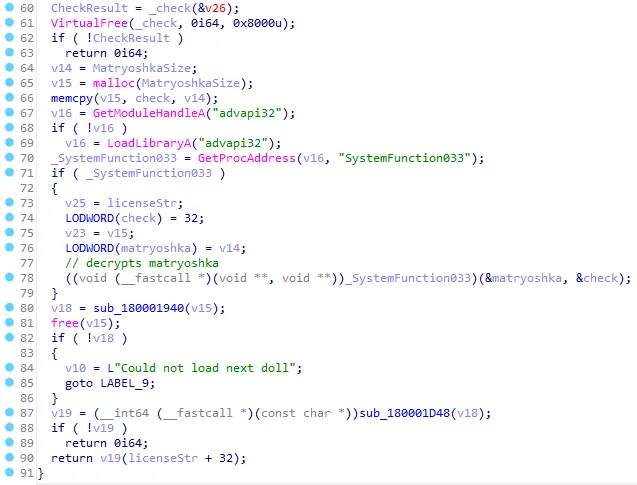

1.  The program allocates and loads **matryoshka str** (the giant 60mb one)**.**
2.  Gets **SystemFunction033** from _advapi32_
3.  Calls **SystemFunction033(matryoshka, license)**, don’t be fooled by IDA’s argument names

**SystemFunction033** is an _undocumented_ function from Windows that is used for encryption/decryption, the first argument is what we want to encrypt or decrypt and the second is the key.

The problem here is that the type of these arguments is

```c
struct ustring {
 DWORD Length;
 DWORD MaximumLength;
 PVOID Buffer;
}
// from wine project
```

> _But the assembly is using already defined and renamed variables, that’s why in IDA it looks like its decrypting matryoshka with check. But it is decrypting matryoshka with the license we used. In lines 73 to 76 you can see that it assigns licenseStr pointer and a size of 32bytes, also prepares matryoshka ustring_

After the decryption, what do we get?

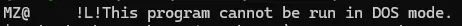

Oh wait! **_MZ_**, that’s a PE file! Yes, in fact it is a DLL…

A Doll.dll…

> Another Doll.dll…
> 
> with another matryoshka and another check…
> 
> with new magic values and weird strings…
> 
> with more bytes for longer license.bin to be discovered…

After scripting **_everything_** in this orchestrator.py (yes this took time)

```python
from fix_check import fix_check
from jumpcut import jumpcut
from find_offsets import find_offsets
from find_weird_string import find_weird_string
from magic import get_magic
from weird import solve
from decrypt import decrypt
from extractor import extract
import shutil
with open("./license.bin", "wb") as license:
    pass
fix_check("CHECK.bin", "./FIXED_CHECK.bin")
#jumpcut("./FIXED_CHECK.bin", "./FIXED_JUMPCUT_CHECK.bin")
shutil.copy("./FIXED_CHECK.bin", "./FIXED_JUMPCUT_CHECK.bin")
offsets = find_offsets("./FIXED_JUMPCUT_CHECK.bin")
weird_string = find_weird_string("./FIXED_JUMPCUT_CHECK.bin", offsets)
magic = get_magic("./FIXED_JUMPCUT_CHECK.bin")
key = solve(magic, weird_string)
decrypt("./MATRYOSHKA.bin", "./license.bin", "NextDoll.dll")
print(key)
extract("NextDoll.dll", "./NextCheck.bin", "./NextMatryoshka.bin")
while True:
    fix_check("./NextCheck.bin", "./NextCheckFixed.bin")
    #jumpcut("./NextCheckFixed.bin", "./NextCheckFixedJumpcut.bin")
    
    shutil.copy("./NextCheckFixed.bin", "./NextCheckFixedJumpcut.bin")
    offsets = find_offsets("./NextCheckFixedJumpcut.bin")
    weird_string = find_weird_string("./NextCheckFixedJumpcut.bin", offsets)
    magic = get_magic("./NextCheckFixedJumpcut.bin")
    key = solve(magic, weird_string)
    decrypt("./NextMatryoshka.bin", "./license.bin", "./NextDoll.dll")
    print(key)
    extract("NextDoll.dll", "./NextCheck.bin", "./NextMatryoshka.bin")
```

After running it for a loooooooong time, more than 20minutes, I’m not sure because I just left the computer, we got this big license.bin:

> M0Oo8zjHkcPSWFzCxmw6jrj1RgNPucTHnE0OSzTLiLdrMGsKxaP34YlM8LHyOVtB41PDnuoUhyOZQKi3VX9VBpSN1BwNwGgxYoGsu8zPTrtnnJaYUgs63QFnztGi9jb3mpkxi4CzyLpaplSNfCsiXPKcfgxmDNbefLMBmmOnGopH5ro5neXyk5XluG3MbAJwShXHN8qMc6UziZc5RtGnUMZt3JQSZmPUiQRXaq0qMGx56kRI3acoaASBfRKU9SklXShPoGDfsDGzSnVkFC8KjLrVPSFJvQqJjPXuUkfonwGxayY4l4mUZegwQaf4HYYFnZh0RIr3gJeDTNzft0hf7atapmHHEXDc8sVxrZ4p0HshMDnHD0us9WKc33OoQCAc8iiOy81uP5b5slU7HQ0sKaqoXxNsaIBAVqGeUSX9wZ4mup7ycXaCegjSwjdKLuxjSDORjMnc5IQ4EqLqStDNN4EvdoMWAlAgCLeloR0UCrASNtwNtGIYXokxEFiN0DjlKJtvgdSC5opwW6VFSWDiyAfIeq1l7QS22i1Q99efyBoFHtISp1qxyMIGNS6J4vTDXliSiSCD0L0w30mPcNtKGvVywYDasg73vSFPwBQXMlLicHX9PPCkW9o6b3fOfnqeoxBgg3YdQ6hPveSp6Xi5JEf4YrwwPHERCm7GwEiag3Z17NRj9M6dz96LMiUfXelXxJ63nXSQ0e9eELh5DyCU0nK7OKEfVT0fvoa5soVi7A5ABF1T7Wi0nMV15Fe7rT0OLV6UpefmBZD3JjAArjCvVXbHRYyZOuIf4qtihb4uCUCjFIprFfGr2LfBnnZghQskuavSfoRzMwRjQuDH5ubgWaNlBBMk5DrcFMNQl5KlqOmNEuB3yA1DYl1BAKu8eA3qKNVPPm4eaWAK0hYHPzYyDL187mwVm57DvTsab5bGTfzZlSPIdnXFTai2Nl218tQBxc1xVHRKLSOfVhvVu6QyVx5T7OJe6jgmqXqeN8rR9g3vGBC5SNriUwe8KilrIU0RnxTlpPL88qoSRpfJWYdk0dHfTn1Y3mP1MOJDyqoLbIHoUpNreDUXHwsvJ8OCH9qg34uOHadBAFvslwaJY6Kdq7AzJ6AFSPXMEXaT568QESzlVjYU1pjQENpMXy7qzuqX2ESzWkblV1unRFZTavYKo9jT2HD6zDB5E3CCo36S7IlnJDCoI15eR8aRewZlTg3dC3F3m4qlsK7Xnm6KvimfyBO7NcvYik5uflTDjMXSK0DGCakF2a9GAEgIAQkMwy8QNE6Y1DhvBl9c6s7SDrHkO0HIiOgWzZYJvuUtBqiN6I4eJdeRBiamjiyUJvoWazijTGSRK9rVcH8Z7CN03j1tx6tqfK7rFheKhGtuwlJqu0v49GrrFkqJsfjpaFmQK0qvOab8Ukhf4F2owFwdhzb9xwvg9Bnt3Wp60zrMTGICBbkYDCFHiyvH1N6SQiwdLKoboz4BdU3Yf4zLSQKVHFA1lAArgl7BJ8aClz1W04LzQH4rQ6c4V42oWpPbFiXpoNzWlP7rg4GuNYlCdlKnmNQtXtmrdUUy2sPG5CLjB3Jp7TDRYQWzMVSRtW9NFgRhOv2y

## What happens when we use this license?

We wait for about _7 seconds_ for the full checking to take in place and theeeeen:

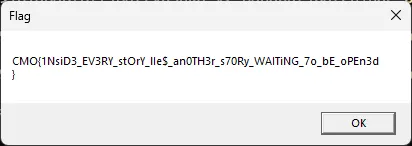

_CMO{1NsiD3_EV3RY_stOrY_lIe$_an0TH3r_s70Ry_WAITiNG_7o_bE_oPEn3d}_

Finally! Great!

## Thoughts

This was a really great and fun challenge. I’m really interested in Reverse Engineering, specially Windows binaries. I just went to [crackmes.one](https://crackmes.one), to find some cool challenges and stepped upon this one. I first didn’t like the protector, but I think it was important to make me go and start scripting already, thanks for [**jeffli6789**](https://crackmes.one/user/jeffli6789), who uploaded the challenge

## Check out

I’m currently participating in three really important groups here in my univeristy (Universidade Federal de São Carlos, UFSCAR) Brazil:

### PATOS

[https://patos.dev](https://patos.dev)

An open-source focused group, which teaches about computer security and general knowledge for people in the univerity and takes action into contributing to open source in general. This group (PATOS) is also associated with:

### POMBO

[POMBO](https://patos.dev/tags/pombo/)

**POMBO, which is a _offensive security_ focused group which is maintained by PATOS**

### Cloudlabs UFSCar

Grupo de pesquisa do Departamento de Computação da UFSCar, dedicado à pesquisa e ao desenvolvimento em tecnologias para...

[https://cloudlabs.ufscar.br](https://cloudlabs.ufscar.br)

**CloudLabs**, which is a research group in partnership with Magalu (Magazine Luiza) whose aim is to provide better technology for cloud infrastructure

I really hope you check out all of these groups and liked this writeup!
