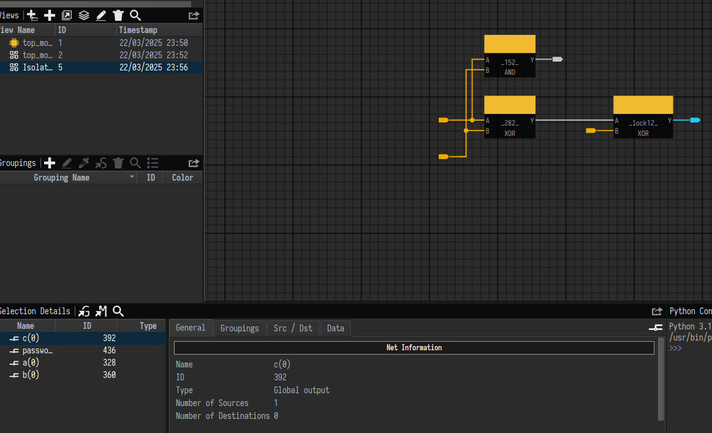
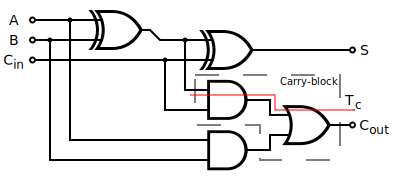
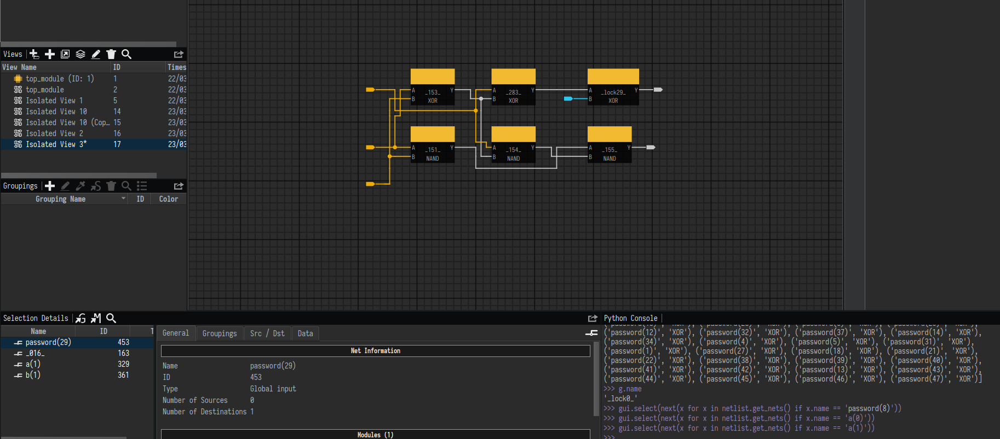
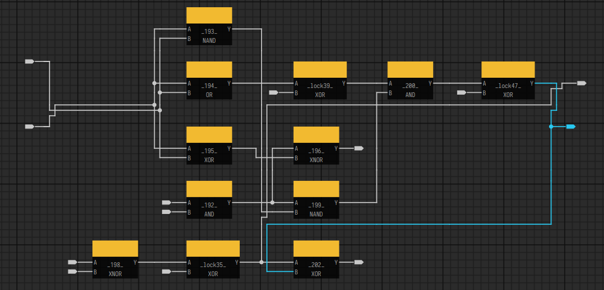

+++
date = 2025-04-15T11:00:00-03:00
draft = false
title = "WolvCTF 2025 — LockDown"
description = "WolvCTF 2025 — LockDown challenge write-up"
tags = ['CTF', 'reversing', 'hardware']
categories = []
featured = true
[params]
  locale = "en"
+++

It has been a few weeks since we played WolvCTF 2025, but I've been longing to write about LockDown, a simple but fun hardware reverse engineering challenge.

The problem statement follows:

> I'm trying to use this adder, but I can't figure out what password gets it to work. Can you figure it out?
>
> NOTE: to get the flag, convert the password bit-string into an ASCII string, with password[47] as the MSB and password[0] as the LSB. For example, the password 01100101011110000110000101101101011100000110110001100101 would be converted to wctf{example}.
>
> Files: [synth.v](synth.v)

Recently, I've been playing with [EMSEC HAL](https://github.com/emsec/hal) to see how it has evolved [since 2020](https://github.com/pwn2winctf/challenges-2020/blob/master/rev-pwn-hw-Hardware-Trojan/README.md#suggestions-for-future-work). Thus, I decided I'd try to use HAL to solve this challenge.


## Opening the netlist in HAL

**Note**: you can [download my HAL project](hal_project_synth.zip) if you want to skip the steps below.

First we need to open the Verilog file by going to the `File -> Import -> Import Netlist` menu. HAL will ask for a gate library. If we don't know which one to use, we can ask to auto detect. It will then match a netlist which has a definition for every gate used by the Verilog netlist we asked to import.

In our case an error message shows up, since none of the gate libraries which come with HAL will match. To see this error message, you need to have opened HAL from a console, since error messages produced before the project is actually open don't seem to be displayed in the GUI.

```plain
[15.04.2025 14:39:46] [netlist_parser] [info] instantiating '/home/matias/ctf/wolv/synth.v' with gate library 'lsi_10k'...
[15.04.2025 14:39:46] [netlist_parser] [info] failed to instantiate '/home/matias/ctf/wolv/synth.v' with gate library 'lsi_10k':
[/home/builder/build/src/hal-emsec/plugins/verilog_parser/src/verilog_parser.cpp:326] could not instantiate Verilog netlist '/home/matias/ctf/wolv/synth.v' with gate library 'lsi_10k': unable to construct netlist
[/home/builder/build/src/hal-emsec/plugins/verilog_parser/src/verilog_parser.cpp:1272] could not construct netlist: unable to instantiate top module
[/home/builder/build/src/hal-emsec/plugins/verilog_parser/src/verilog_parser.cpp:1847] could not create instance 'top_module' of type 'add': failed to find gate type 'NAND' in gate library 'lsi_10k'
```

The error message above is repeated for each gate library available. It is just saying that none of these gate libraries have a gate called `NAND`.

Thus, we need to write our own gate library. We copied `example_library.hgl` to a new file called [wolv\_ctf.hgl](wolv_ctf.hgl) and edited it.

What is important to note is that, due to how HAL internal representation of netlists work, we need to have a "power" gate and a "ground" gate, even though these are not explicitly referenced by [synth.v](synth.v). We just keep `VCC` and `GND` from the example file.

Now for the other gates, we add an entry for each gate referenced by [synth.v](synth.v). Pin names need to match. For example,

```verilog
NAND _133_ (
    .A(a[12]),
    .B(b[12]),
    .Y(_130_)
);
```

means the `NAND` gate has pins called `A`, `B` and `Y`. From context, we know `A` and `B` are inputs, and `Y` is an output. This also needs to be informed in the [wolv\_ctf.hgl](wolv_ctf.hgl) file. Finally, we need to write a boolean function describing the `Y` output, which in this case is `(! (A & B))`. By knowing these boolean functions, HAL is able to show truth tables, simulate parts of the circuit, solve equations using SMT, and all kinds of nice stuff.

Once a gate library containing all referenced gates is created, `Import Netlist` will succeed and a HAL project will be created. Don't worry, if you forget to include one gate in the gate library, an error message will be displayed at the console again, mentioning which gate was forgotten.

## Failed attempt: structural analysis

HAL is a very nice tool to follow parts of the circuit diagram to carry out a structural analysis of the netlist. By right-clicking some gate or some net, a context menu option called `Isolate gate in new view` or `Isolate net endpoints in new view` appears. A new "Isolated View" is then opened as a new tab in the project, from which we can follow nets and add to the view only what matters to us, i.e. gates and nets which seem to influence the part of the circuit we are analyzing at the moment.

First attempt was to follow the `c(0)` output of the adder.

It can be difficult to find a net in a huge netlist. The GUI seems to currently provide no way to search nets by name. A quick hack is to run `gui.select(next(x for x in netlist.get_nets() if x.name == 'c(0)'))` in the interactive Python Console. If the selected net still does not show up on screen, we can right-click its name in the `Selection Details` panel and choose `Focus net in Graph View`.

Following the path by using keyboard arrows, we add related gates to the view.



By looking at the diagram above, we can see gate `_lock12_` will flip the result of `a(0) + b(0)` unless `password(12)` is 0. The first hypothesis was that a XOR would be connected to a password input when the correct password bit was 0, or a XNOR when it was 1.

Now HAL's interactive Python Console comes handy again. Although the API is a bit convoluted, we can quickly validate hypothesis as we work.

```python
>>> password = [(x.name,x) for x in netlist.get_nets() if x.name.startswith('password')]
>>> [(a,len(b.get_destinations())) for a,b in password]
[('password(0)', 1), ('password(8)', 1), ('password(10)', 1), ('password(23)', 1), ('password(7)', 1), ('password(2)', 1), ('password(11)', 1), ('password(16)', 1), ('password(17)', 1), ('password(19)', 1), ('password(35)', 1), ('password(24)', 1), ('password(25)', 1), ('password(30)', 1), ('password(20)', 1), ('password(36)', 1), ('password(26)', 1), ('password(33)', 1), ('password(3)', 1), ('password(9)', 1), ('password(15)', 1), ('password(28)', 1), ('password(6)', 1), ('password(29)', 1), ('password(12)', 1), ('password(32)', 1), ('password(37)', 1), ('password(14)', 1), ('password(34)', 1), ('password(4)', 1), ('password(5)', 1), ('password(31)', 1), ('password(1)', 1), ('password(27)', 1), ('password(18)', 1), ('password(21)', 1), ('password(22)', 1), ('password(38)', 1), ('password(39)', 1), ('password(40)', 1), ('password(41)', 1), ('password(42)', 1), ('password(13)', 1), ('password(43)', 1), ('password(44)', 1), ('password(45)', 1), ('password(46)', 1), ('password(47)', 1)]
```

The above result means that every password bit is inputted to a single gate, which is nice since it simplifies our analysis.

```python
>>> [(a,b.get_destinations()[0].get_gate().get_type().name) for a,b in password]
[('password(0)', 'XOR'), ('password(8)', 'XOR'), ('password(10)', 'XOR'), ('password(23)', 'XOR'), ('password(7)', 'XOR'), ('password(2)', 'XOR'), ('password(11)', 'XOR'), ('password(16)', 'XOR'), ('password(17)', 'XOR'), ('password(19)', 'XOR'), ('password(35)', 'XOR'), ('password(24)', 'XOR'), ('password(25)', 'XOR'), ('password(30)', 'XOR'), ('password(20)', 'XOR'), ('password(36)', 'XOR'), ('password(26)', 'XOR'), ('password(33)', 'XOR'), ('password(3)', 'XOR'), ('password(9)', 'XOR'), ('password(15)', 'XOR'), ('password(28)', 'XOR'), ('password(6)', 'XOR'), ('password(29)', 'XOR'), ('password(12)', 'XOR'), ('password(32)', 'XOR'), ('password(37)', 'XOR'), ('password(14)', 'XOR'), ('password(34)', 'XOR'), ('password(4)', 'XOR'), ('password(5)', 'XOR'), ('password(31)', 'XOR'), ('password(1)', 'XOR'), ('password(27)', 'XOR'), ('password(18)', 'XOR'), ('password(21)', 'XOR'), ('password(22)', 'XOR'), ('password(38)', 'XOR'), ('password(39)', 'XOR'), ('password(40)', 'XOR'), ('password(41)', 'XOR'), ('password(42)', 'XOR'), ('password(13)', 'XOR'), ('password(43)', 'XOR'), ('password(44)', 'XOR'), ('password(45)', 'XOR'), ('password(46)', 'XOR'), ('password(47)', 'XOR')]
```

The above result means that every password bit is connected to a XOR, thus our initial hypothesis was invalid.

Would all of these XOR be connected directly to an output of the adder, i.e. `c(*)`? If yes, it would mean some output bits are inverted before being fed to the final XOR, whereas other output bits are not.

```python
>>> [(a,b.get_destinations()[0].get_gate().fan_out_nets[0].name) for a,b in password]
[('password(0)', '_026_'), ('password(8)', '_080_'), ('password(10)', '_111_'), ('password(23)', '_125_'), ('password(7)', '_093_'), ('password(2)', '_082_'), ('password(11)', '_122_'), ('password(16)', '_132_'), ('password(17)', 'c(6)'), ('password(19)', '_096_'), ('password(35)', '_059_'), ('password(24)', '_010_'), ('password(25)', 'c(12)'), ('password(30)', '_119_'), ('password(20)', '_000_'), ('password(36)', '_065_'), ('password(26)', '_044_'), ('password(33)', '_004_'), ('password(3)', '_074_'), ('password(9)', '_049_'), ('password(15)', '_043_'), ('password(28)', '_051_'), ('password(6)', '_035_'), ('password(29)', 'c(1)'), ('password(12)', 'c(0)'), ('password(32)', '_126_'), ('password(37)', '_053_'), ('password(14)', '_100_'), ('password(34)', '_115_'), ('password(4)', '_058_'), ('password(5)', '_029_'), ('password(31)', 'c(8)'), ('password(1)', '_086_'), ('password(27)', '_028_'), ('password(18)', '_046_'), ('password(21)', '_009_'), ('password(22)', 'c(13)'), ('password(38)', '_005_'), ('password(39)', '_056_'), ('password(40)', 'c(30)'), ('password(41)', 'c(9)'), ('password(42)', '_037_'), ('password(13)', '_091_'), ('password(43)', '_114_'), ('password(44)', '_106_'), ('password(45)', 'c(19)'), ('password(46)', '_027_'), ('password(47)', '_061_')]
```

The answer is no. Some of these XORs are, in fact, connected to an output of the adder, but others are connected to internal nets called `_somenumber_`.

At this point, we can already suspect the lock logic is not being added just to the direct path from inputs to outputs of the adder (i.e. from A and B to S in the diagram below), but also to the carry blocks.



To confirm this, we run the following snippet:

```python
>>> [(a,b.get_destinations()[0].get_gate().get_predecessors()[0].get_gate().get_type().name) for a,b in password]
[('password(0)', 'XNOR'), ('password(8)', 'AND'), ('password(10)', 'XOR'), ('password(23)', 'NAND'), ('password(7)', 'XOR'), ('password(2)', 'NAND'), ('password(11)', 'NAND'), ('password(16)', 'NAND'), ('password(17)', 'XOR'), ('password(19)', 'NAND'), ('password(35)', 'XNOR'), ('password(24)', 'XOR'), ('password(25)', 'XOR'), ('password(30)', 'XNOR'), ('password(20)', 'NOR'), ('password(36)', 'OR'), ('password(26)', 'AND'), ('password(33)', 'NOR'), ('password(3)', 'NOR'), ('password(9)', 'AND'), ('password(15)', 'NAND'), ('password(28)', 'NAND'), ('password(6)', 'AND'), ('password(29)', 'XOR'), ('password(12)', 'XOR'), ('password(32)', 'XNOR'), ('password(37)', 'AND'), ('password(14)', 'AND'), ('password(34)', 'NAND'), ('password(4)', 'NAND'), ('password(5)', 'XOR'), ('password(31)', 'XOR'), ('password(1)', 'XNOR'), ('password(27)', 'AND'), ('password(18)', 'NAND'), ('password(21)', 'AND'), ('password(22)', 'XNOR'), ('password(38)', 'AND'), ('password(39)', 'OR'), ('password(40)', 'XNOR'), ('password(41)', 'XNOR'), ('password(42)', 'AND'), ('password(13)', 'AND'), ('password(43)', 'NAND'), ('password(44)', 'NAND'), ('password(45)', 'XOR'), ('password(46)', 'AND'), ('password(47)', 'AND')]
```

Since the correct adder only uses XOR, AND and OR gates, we raise another hypothesis: maybe XNOR, NAND and NOR only appear when the password bit fed to their XOR successor is 1.

To validate the new hypothesis, we isolate other 1-bit full adders for visual inspection.



The isolated view above shows a full adder which only got lock logic in the direct path from inputs to outputs. We can clearly identify the carry block is implemented by the 3 NAND gates at the bottom. This is different from the Wikipedia diagram we have just shown. Fair enough, but if the synthesis tool considered it more optimal to implement the carry block with 3 NAND gates (instead of 2 AND gates and 1 OR gate), how come OR gates appear at other parts of the circuit?

Let's look for a part of the circuit which uses OR so we can get a sense of what is going on.



The selected net above (shown in cyan) is the carry out of `a(15) + b(15)`.

Very convoluted. Although it seems like it would be possible to analyze all possibilities and write a script to find the patterns in the graph, it starts to seem like too much work and too prone to error. We decide to try a more general and automated approach.


## Solving with SMT

What if we could ask HAL to solve password bits as unknowns in an equation such that the adder provided in [synth.v](synth.v) gives the same result as an ordinary adder? That would work and we won't need to worry with the circuit structure.

HAL even comes with an [example](https://github.com/emsec/hal/blob/39d1eaa532d42b178cf0b78acc58c522e2f7f1aa/examples/simple_alu/py/smt.py) on how to use a SMT solver to prove some circuit behaves as an adder. We use that example as a starting point.

Our first attempt was naively adapting the example to deal with the password unknowns.

```python
output_functions = {}

for net in netlist.nets:
    if net.name.startswith('c('):
        i = int(net.name.replace('c(','').replace(')',''))
        output_functions[i] = hal_py.NetlistUtils.get_subgraph_function(net, netlist.gates)

# get multibit boolean functions
output_c = output_functions[0]
for i in range(1, 32):
    new_size = output_functions[i].get_size() + output_c.get_size()
    output_c = hal_py.BooleanFunction.Concat(output_functions[i], output_c, new_size)

# substitute variable names with their original input
# important: get rid of brackets, due to smt2 syntax
for net in netlist.nets:
    output_c = output_c.substitute("net_" + str(net.get_id()), net.get_name().replace("(", "").replace(")",""))

var_a = hal_py.BooleanFunction.Var("a0", 1)
var_b = hal_py.BooleanFunction.Var("b0", 1)
for i in range(1,32):
    new_size = 1 + var_a.get_size()
    var_a = hal_py.BooleanFunction.Concat(hal_py.BooleanFunction.Var("a" +str(i), 1), var_a, new_size)
    var_b = hal_py.BooleanFunction.Concat(hal_py.BooleanFunction.Var("b" +str(i), 1), var_b, new_size)

var_p = hal_py.BooleanFunction.Var("password0", 1)
for i in range(1,48):
    new_size = 1 + var_p.get_size()
    var_p = hal_py.BooleanFunction.Concat(hal_py.BooleanFunction.Var("password" +str(i), 1), var_p, new_size)

#build constraints
const_one = hal_py.BooleanFunction.Const(hal_py.BooleanFunction.Value.ONE)
const_zero = hal_py.BooleanFunction.Const(hal_py.BooleanFunction.Value.ZERO)

adder = hal_py.SMT.Constraint(hal_py.BooleanFunction.Not(hal_py.BooleanFunction.Eq(hal_py.BooleanFunction.Add(var_a, var_b, 32), output_c, 1), 1))

solver = hal_py.SMT.Solver([adder])
res = solver.query(hal_py.SMT.QueryConfig().with_solver(hal_py.SMT.SolverType.Z3).with_local_solver().with_model_generation().with_timeout(1000))
print(res.type)
p_res = res.model.evaluate(var_p)
print('password:', p_res)
print(int(str(p_res),2).to_bytes(48//8))
```

However, the yielded result didn't make sense:

```
SolverResultType.Sat
password: 0b000111000010010100011111101011011010010001001010
b'\x1c%\x1f\xad\xa4J'
```

We then realized the SMT was solving for a **specific case** of inputs a and b, i.e. the password it found would work for these specific inputs it chose at random, but not for others.

For the [HAL example](https://github.com/emsec/hal/blob/39d1eaa532d42b178cf0b78acc58c522e2f7f1aa/examples/simple_alu/py/smt.py), this was not a problem, since it was producing **UnSat** to prove no inputs existed which made the output of the adder under analysis **different** from a reference adder. Please note we are producing **Sat** because we are looking for the case where the output of the adder under analysis is **equal** to the reference adder.

In other words, we need to solve ∀a,b, whereas the example solves ∃a,b.

Now that was somewhat tricky. We searched HAL code base for something like `ForAll` and found nothing. The Z3 solver supports `ForAll`, but perhaps not every SMT solver supports it. HAL has some abstraction and allows to use Z3, Boolector or Bitwuzla as a SMT solver.

The solution was a hack. We chose some a,b inputs at random and added an equation substituting each a,b pair as a new constraint. The more a,b pairs we added, the better we would approximate a `ForAll`.

```python
import os

output_functions = {}

for net in netlist.nets:
    if net.name.startswith('c('):
        i = int(net.name.replace('c(','').replace(')',''))
        output_functions[i] = hal_py.NetlistUtils.get_subgraph_function(net, netlist.gates)

# get multibit boolean functions
output_c = output_functions[0]
for i in range(1, 32):
    new_size = output_functions[i].get_size() + output_c.get_size()
    output_c = hal_py.BooleanFunction.Concat(output_functions[i], output_c, new_size)

# substitute variable names with their original input
# important: get rid of brackets, due to smt2 syntax
for net in netlist.nets:
    output_c = output_c.substitute("net_" + str(net.get_id()), net.get_name().replace("(", "").replace(")",""))

var_a = hal_py.BooleanFunction.Var("a0", 1)
var_b = hal_py.BooleanFunction.Var("b0", 1)
for i in range(1,32):
    new_size = 1 + var_a.get_size()
    var_a = hal_py.BooleanFunction.Concat(hal_py.BooleanFunction.Var("a" +str(i), 1), var_a, new_size)
    var_b = hal_py.BooleanFunction.Concat(hal_py.BooleanFunction.Var("b" +str(i), 1), var_b, new_size)

var_p = hal_py.BooleanFunction.Var("password0", 1)
for i in range(1,48):
    new_size = 1 + var_p.get_size()
    var_p = hal_py.BooleanFunction.Concat(hal_py.BooleanFunction.Var("password" +str(i), 1), var_p, new_size)

#build constraints
const_one = hal_py.BooleanFunction.Const(hal_py.BooleanFunction.Value.ONE)
const_zero = hal_py.BooleanFunction.Const(hal_py.BooleanFunction.Value.ZERO)
def const_rand():
    r = os.urandom(1)[0]&1
    return const_one if r==1 else const_zero

bf_adder = hal_py.BooleanFunction.Eq(hal_py.BooleanFunction.Add(var_a, var_b, 32), output_c, 1)

constrs = []

# increase number of runs if not enough to emulate ForAll
for run_no in range(16):
    print(run_no)
    dic = {}
    for i in range(32):
        dic[f"a{i}"] = const_rand()
        dic[f"b{i}"] = const_rand()
    special_case = bf_adder.substitute(dic)
    #print(str(special_case))
    constrs.append(hal_py.SMT.Constraint(special_case))

solver = hal_py.SMT.Solver(constrs)
res = solver.query(hal_py.SMT.QueryConfig().with_solver(hal_py.SMT.SolverType.Z3).with_local_solver().with_model_generation().with_timeout(1000))
print(res.type)
p_res = res.model.evaluate(var_p)
print('password:', p_res)
print(int(str(p_res),2).to_bytes(48//8))
```

We arrive at the password, at last:

```
SolverResultType.Sat
password: 0b011101010110111001001100001100000110001101001011
b'unL0cK'
```

Wrapping with the flag format, as requested by the problem statement, we get `wctf{unL0cK}`.

Looks like we could have just guessed it from the challenge name :P I hate small flags.


## Alternate solution with yosys-smtbmc

Ever since reading [q3k's writeup](https://blog.dragonsector.pl/2018/08/code-blue-ctf-2018-quals-watchcats.html) of a challenge he solved using yosys-smtbmc, I was wondering if I'd find some challenge I could solve using that tool. Then, after WolvCTF was finished, I decided to give a try at an alternate solution, and it was actually much simpler than the solution we carried out during the CTF.

First, we need to define our [gate library in Verilog RTL](smtbmc/structs.sv), so that yosys will understand what each gate is meant to do. That is quite easy, for instance NAND is defined as:

```verilog
module NAND (
    input A,
    input B,
    output Y
);
    assign Y = ~(A & B);
endmodule
```

Then we need to write a testbench. We leave `password` with its initial value undefined, since it's an unknown, and use a `cover` statement so that the tool will solve for a condition where the adder produces the same output as `a + b`.

Now we employ a similar trick we previously used with HAL. Since we cannot express a "for all" in Verilog (or maybe we can? I'm not experienced enough with formal verification in Verilog), we replicate the adder a few times, providing random inputs to each instance, and constraint that all of the instances must produce the same output as `a + b`.

We can generate Verilog for this using the [gomplate](https://gomplate.ca) template language.

```verilog
{{ $runs := 16 }}
module top();

    reg [47:0] password;

{{ range $i := seq 1 $runs }}
    reg  [31:0] a{{ $i }};
    reg  [31:0] b{{ $i }};
    wire [31:0] c{{ $i }};

    add _{{ $i }}_ (
        .a(a{{ $i }}),
        .b(b{{ $i }}),
        .c(c{{ $i }}),
        .password(password)
    );
{{ end}}

    initial begin
{{- range $i := seq 1 $runs }}
        a{{ $i }} = {{ random.Number 0 0xffffffff }};
        b{{ $i }} = {{ random.Number 0 0xffffffff }};
{{- end}}
        // if we do not set an initial value for password,
        // the tool will find a value such that the
        // cover statement below is SAT
    end

    always @(*) begin
        cover (
            c1 == (a1 + b1)
            {{- range $i := seq 2 $runs }}
            && c{{ $i }} == (a{{ $i }} + b{{ $i }})
            {{- end}}
        );
    end

endmodule
```

Please check this [blog's repository at GitHub](https://github.com/cloudlabs-ufscar/blog/tree/main/content/sec/wolv-ctf-2025-lockdown/smtbmc) for the complete auxiliary files needed to reproduce this solution.

```
$ make
gomplate -f "top.v.tmpl" -o "top.v"
sby -f "top.sby"
SBY  1:05:17 [top] Removing directory '/home/matias/30b6a5092a659856061cf1070fa328eb/top'.
SBY  1:05:17 [top] Copy '/home/matias/30b6a5092a659856061cf1070fa328eb/top.v' to '/home/matias/30b6a5092a659856061cf1070fa328eb/top/src/top.v'.
SBY  1:05:17 [top] Copy '/home/matias/30b6a5092a659856061cf1070fa328eb/synth.v' to '/home/matias/30b6a5092a659856061cf1070fa328eb/top/src/synth.v'.
SBY  1:05:17 [top] Copy '/home/matias/30b6a5092a659856061cf1070fa328eb/structs.sv' to '/home/matias/30b6a5092a659856061cf1070fa328eb/top/src/structs.sv'.
SBY  1:05:17 [top] engine_0: smtbmc yices
SBY  1:05:17 [top] base: starting process "cd top/src; yosys -ql ../model/design.log ../model/design.ys"
SBY  1:05:17 [top] base: Warning: Wire top.\password [47] is used but has no driver.
[...]
SBY  1:05:17 [top] prep: Warning: Wire top.\password [0] is used but has no driver.
SBY  1:05:17 [top] prep: finished (returncode=0)
SBY  1:05:17 [top] smt2: starting process "cd top/model; yosys -ql design_smt2.log design_smt2.ys"
SBY  1:05:17 [top] smt2: finished (returncode=0)
SBY  1:05:17 [top] engine_0: starting process "cd top; yosys-smtbmc -s yices --presat --unroll -c --noprogress -t 2  --append 0 --dump-vcd engine_0/trace%.vcd --dump-yw engine_0/trace%.yw --dump-vlogtb engine_0/trace%_tb.v --dump-smtc engine_0/trace%.smtc model/design_smt2.smt2"
SBY  1:05:18 [top] engine_0: ##   0:00:00  Solver: yices
SBY  1:05:18 [top] engine_0: ##   0:00:00  Checking cover reachability in step 0..
SBY  1:05:18 [top] engine_0: ##   0:00:00  Reached cover statement in step 0 at top: top.v:223.9-240.10 (_witness_.check_cover_top_v_223_2)
SBY  1:05:18 [top] engine_0: ##   0:00:00  Writing trace to VCD file: engine_0/trace0.vcd
SBY  1:05:19 [top] engine_0: ##   0:00:01  Writing trace to Verilog testbench: engine_0/trace0_tb.v
SBY  1:05:19 [top] engine_0: ##   0:00:01  Writing trace to constraints file: engine_0/trace0.smtc
SBY  1:05:19 [top] engine_0: ##   0:00:01  Writing trace to Yosys witness file: engine_0/trace0.yw
SBY  1:05:19 [top] engine_0: ##   0:00:01  Status: passed
SBY  1:05:19 [top] engine_0: finished (returncode=0)
SBY  1:05:19 [top] engine_0: Status returned by engine: pass
SBY  1:05:19 [top] summary: Elapsed clock time [H:MM:SS (secs)]: 0:00:01 (1)
SBY  1:05:19 [top] summary: Elapsed process time [H:MM:SS (secs)]: 0:00:02 (2)
SBY  1:05:19 [top] summary: engine_0 (smtbmc yices) returned pass
SBY  1:05:19 [top] summary: cover trace: top/engine_0/trace0.vcd
SBY  1:05:19 [top] summary:   reached cover statement top._witness_.check_cover_top_v_223_2 at top.v:223.9-240.10 in step 0
SBY  1:05:19 [top] DONE (PASS, rc=0)
wctf{unL0cK}
```